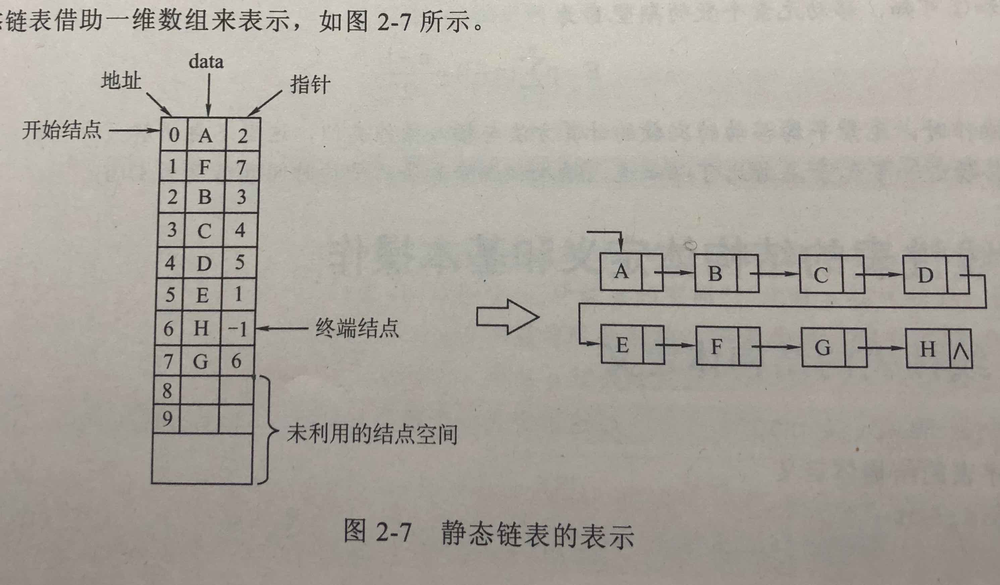

# 线性表

- [线性表](#%E7%BA%BF%E6%80%A7%E8%A1%A8)
  - [基本概念和实现](#%E5%9F%BA%E6%9C%AC%E6%A6%82%E5%BF%B5%E5%92%8C%E5%AE%9E%E7%8E%B0)
  - [结构体定义和基本操作 (见 data-structures )](#%E7%BB%93%E6%9E%84%E4%BD%93%E5%AE%9A%E4%B9%89%E5%92%8C%E5%9F%BA%E6%9C%AC%E6%93%8D%E4%BD%9C-%E8%A7%81-data-structures)

## 基本概念和实现

- 定义：具有相同特性数据元素的一个有限序列。
- 逻辑特性：只有一个表头元素，只有一个表尾元素，除表头元素和表尾元素外，其他元素只有一个前驱和一个后继。
- 存储结构
  - 顺序表（Array-Based List）：依次存储、连续
  - 单链表（Singly linked list）：每个结点包含一个指针域，用以指向其后继结点。
    - 带头结点的单链表：头指针执行头结点，头结点不存储信息，只有指针域，指向第二个结点（第一个存储信息的结点）
    - 不带头结点的单链表：头指针指向第一个结点（第一个存储信息的结点）
  - 双链表（Doubly Linked Lists）：每个结点包含两个指针域，一个指向其后继结点，一个指向其前驱结点。带头结点的双链表、不带头结点的双链表（同上）
  - 循环单链表：单链表的最后一个指针域指向该链表中的第一个结点
  - 循环双链表：双链表的最后一个指针域指向该链表中的第一个结点
  - 静态链表：用数组结构模拟实现单链表（用一个存储数组下标的整型变量找到后继结点在数组中的位置，类似真实指针的功能）
    - 

## 结构体定义和基本操作 (见 [data-structures](https://github.com/liugenjie/data-structures) )

- The ADT for a list (C++描述)

```c++
  template <typename E> class List { // List ADT
  private:
    void operator =(const List&) {}      // Protect assignment
    List(const List&) {}           // Protect copy constructor
  public:
    List() {}          // Default constructor
    virtual  ̃List() {} // Base destructor
    virtual void clear() = 0; // Clear contents from the list, to make it empty.
    virtual void insert(const E& item) = 0; // Insert an element at the current location. item: The element to be inserted
    virtual void append(const E& item) = 0; // Append an element at the end of the list. item: The element to be appended.
    virtual E remove() = 0; // Remove and return the current element. Return: the element that was removed.
    virtual void moveToStart() = 0; // Set the current position to the start of the list
    virtual void moveToEnd() = 0; // Set the current position to the end of the list
    virtual void prev() = 0; // Move the current position one step left. No change if already at beginning.
    virtual void next() = 0; // Move the current position one step right. No change if already at end.
    virtual int length() const = 0; // Return: The number of elements in the list.
    virtual int currPos() const = 0; // Return: The position of the current element.
    virtual void moveToPos(int pos) = 0; // Set current position. pos: The position to make current.
    virtual const E& getValue() const = 0; // Return: The current element.
};
```

- 线性表的结构体定义 (C 描述)

```c

// 顺序表的结构定义
char data[100];

// 单链表的结构定义
typedef struct node{
    char data[100];
    struct node * link;
}LNode, *LinkList;

// 双向链表的结构定义
typedef struct dnode {
    char data[100];
    struct dnode * llink, * rlink;
} DNode, * DLinkList;

```

- 顺序表（Array-Based List）的操作
- 单链表（Singly linked list）的操作
- 双链表（Doubly Linked Lists）的操作
- 循环链表（）的操作