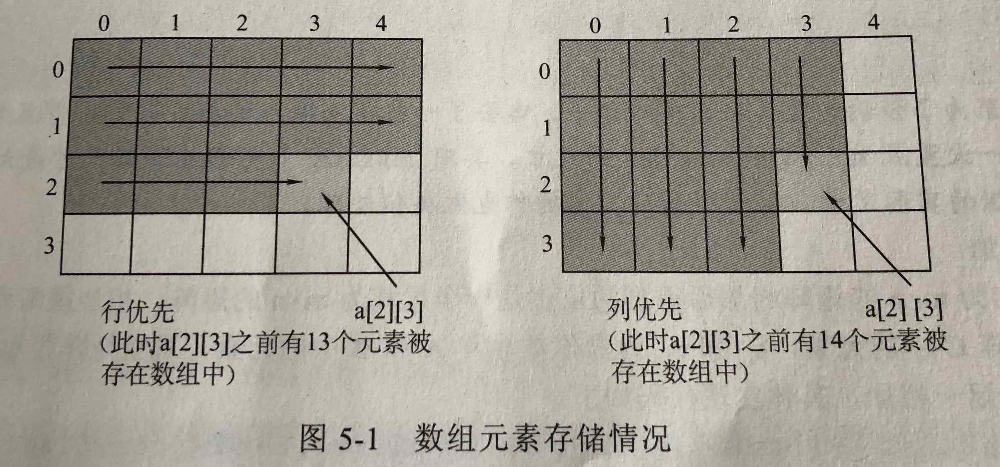
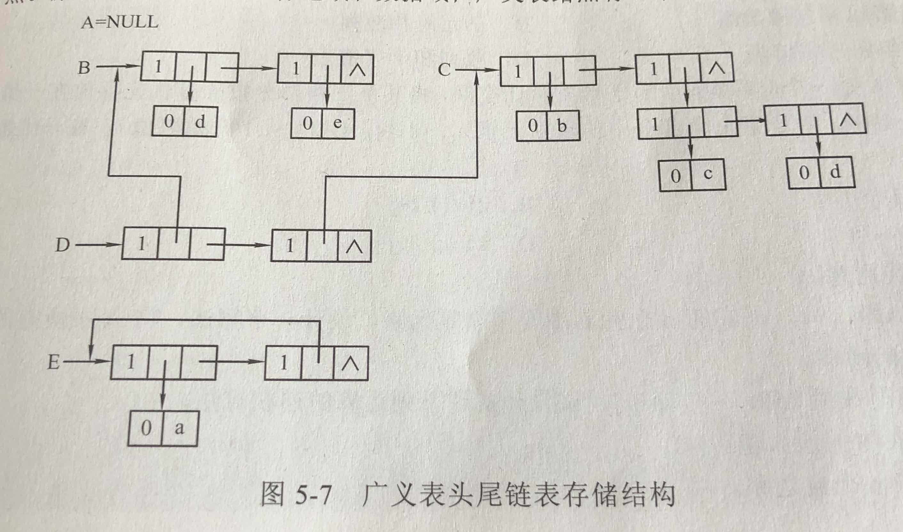
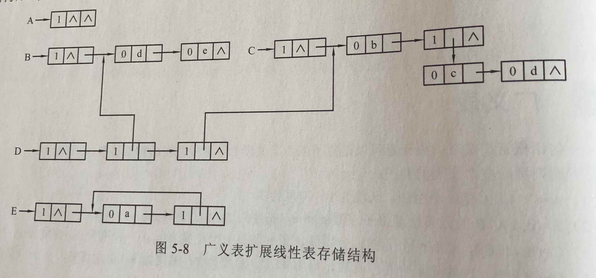

# 数组、矩阵与广义表

- [数组、矩阵与广义表](#%E6%95%B0%E7%BB%84%E3%80%81%E7%9F%A9%E9%98%B5%E4%B8%8E%E5%B9%BF%E4%B9%89%E8%A1%A8)
  - [数组 Array](#%E6%95%B0%E7%BB%84-array)
  - [矩阵 Matrix](#%E7%9F%A9%E9%98%B5-matrix)
  - [广义表 Generalized List](#%E5%B9%BF%E4%B9%89%E8%A1%A8-generalized-list)

## 数组 Array

- 逻辑表示：一维数组，二维数组
- 二维数组的行优先和列优先存储
  - 

## 矩阵 Matrix

- 矩阵：用二维数组存储。常用操作：转置、相加、相乘
- 特殊矩阵：对称矩阵，三角阵，对角矩阵
- 稀疏矩阵：顺序存储（三元组表示法，伪地址表示法），链式存储（邻接表表示法，十字链表表示法）

## 广义表 Generalized List

- 定义：在一个线性表中，元素既可以是原子元素，也可以是另外一个表，这样的线性表为广义表
  - 广义表的长度：最上层元素的个数
  - 广义表的深度：括号的最大层数
  - 表头 head 表尾 tail：第一个元素为表头，其余元素组成的表是表尾
- 存储结构：头尾链表，扩展线性表
  - 
  - 