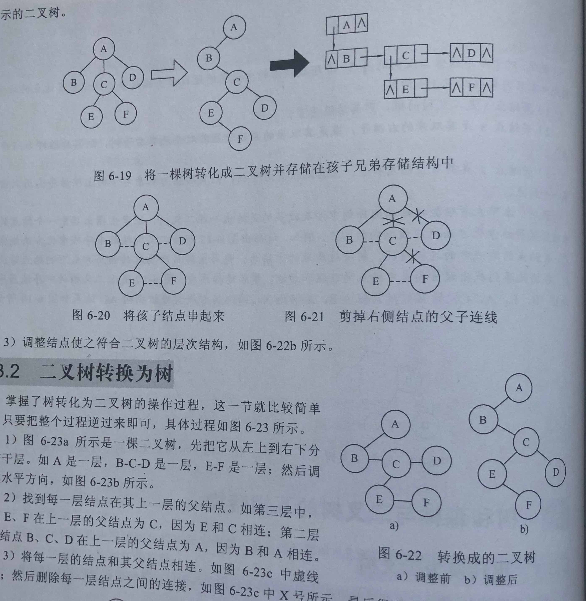
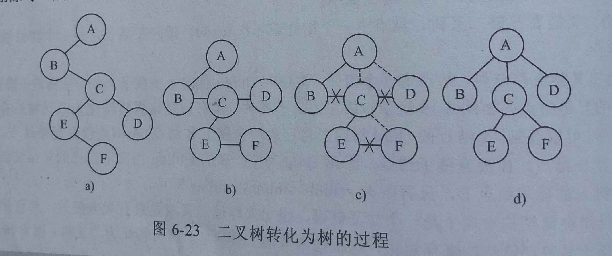
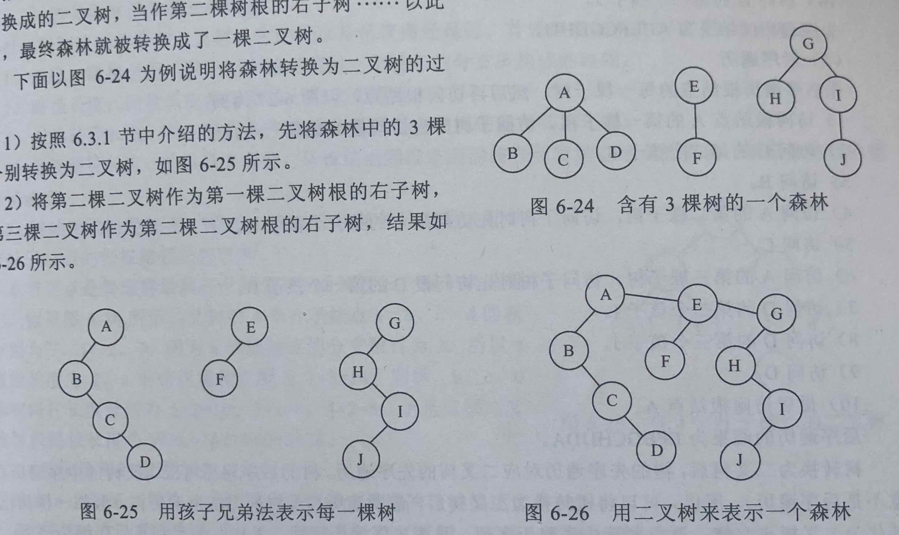
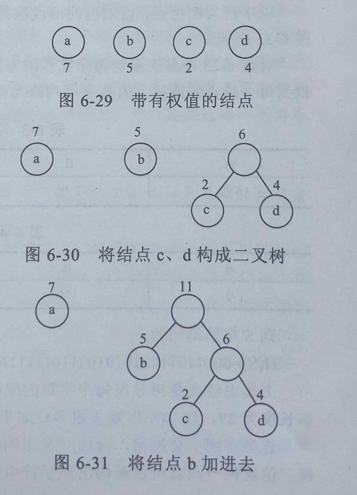
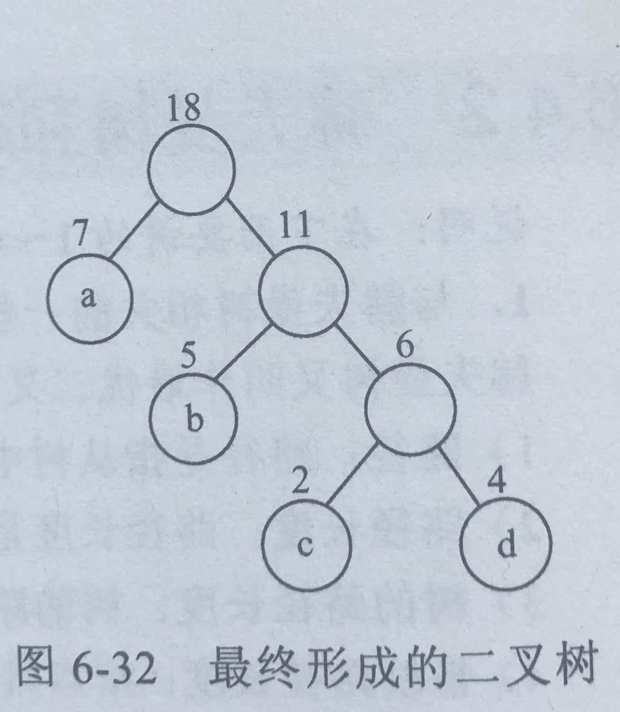

# 树与二叉树

## 树的基本概念

- 定义
- 基本术语：结点、结点的度、树的度、叶子结点、分支结点、孩子、双亲、兄弟、祖先、子孙、层次、树的深度、结点的深度、结点的高度、堂兄弟、无序树、有序树、丰满树、森林
- 存储结构：顺序存储结构，链式存储结构（孩子存储结构、孩子兄弟存储结构）

## 二叉树

- 定义：一般树加以下两个条件：1 结点的度只能为零、一、二，2 子树的顺序不能颠倒

  - 二叉树的五种基本形态
  - 满二叉树
  - 完全二叉树

- 主要性质

  - $n_0=1+n_2$, $n_0=1+n_2+2n_3+...+(m-1)n_m$ m度的结点数n
  - $n_i \le 2^{i-1} \quad (i\ge1)$ 第i层的结点数n
  - $n_k \le 2^k-1 \quad (k\ge1)$ 深度为k的树结点n
  - 若 i 为某结点 a 编号，则
    1. 如果 $i \not= 1$, 它的双亲节点编号为 $\lfloor i/2 \rfloor$
    2. 如果 $2i \le n$，它的左孩子的编号：$2i$
    3. 如果 $2i > n$，它的左孩子：无
    4. 如果 $2i+1 \le n$，它的右孩子的编号：$2i+1$
    5. 如果 $2i+1 > n$，它的右孩子：无
  - Catalan 函数：给定 n 个结点，能构成 $h(n)=\frac {C^n_{2n}}{n+1}$ 种不同的二叉树
  - 具有 n 个结点的完全二叉树的高度（深度）为 $\lfloor log_2n \rfloor+1$

- 存储结构：顺序存储结构，链式存储结构

- 遍历算法（深度优先）：先序遍历（根左右），中序遍历（左根右），后序遍历（左右根），层次遍历

- 遍历算法的改进
  - 非递归实现：自己定义个栈
  - 线索二叉树（Threaded Binary Tree）：将二叉树线索化：利用结点的空链域存储该结点的直接前驱和直接后继

## 树和森林与二叉树的互相转换

- 树转换为二叉树
  - 

- 二叉树转化为树
  - 

- 森林转换为二叉树
  - 

- 二叉树转换为森林

- 树和森林的遍历
  - 树的遍历：先序遍历（根左右），后序遍历（左右根）
  - 森林的遍历：先序遍历（根左右），后序遍历（左右根）

## 树与二叉树的应用

- 二叉排序树（Binary Sort Tree）与平衡二叉树（Balanced Binary Tree），见“查找”

- 赫夫曼树和赫夫曼编码
  - 概念：路径（一结点到另一结点的分支所构成的路线），路径长度（路径上的分支数目），树的路径长度（从根到每个结点的路径长度之和），（结点的）带权路径长度 （从该结点到根的路径长度乘以结点的权值），树的带权路径长度（WPL 所有叶子结点的带权路径长度之和）
  - 赫夫曼树：最优二叉树
  - 构造方法
    - 
    - 
  - 特点：权值越大离根结点越近，没有度为1的结点，带权路径长度最短
  - 赫夫曼编码：
    - 以字符为结点，出现的次数为权值，构造一课赫夫曼树。对每个结点的左右分支编号，左0右1。则从根到每个结点的路径上的数字序列就是每个字符的赫夫曼编码。
    - 赫夫曼编码产生的是最短前缀码
  - 赫夫曼n叉树：有时需要补上权值为0的结点，以构造赫夫曼n叉树