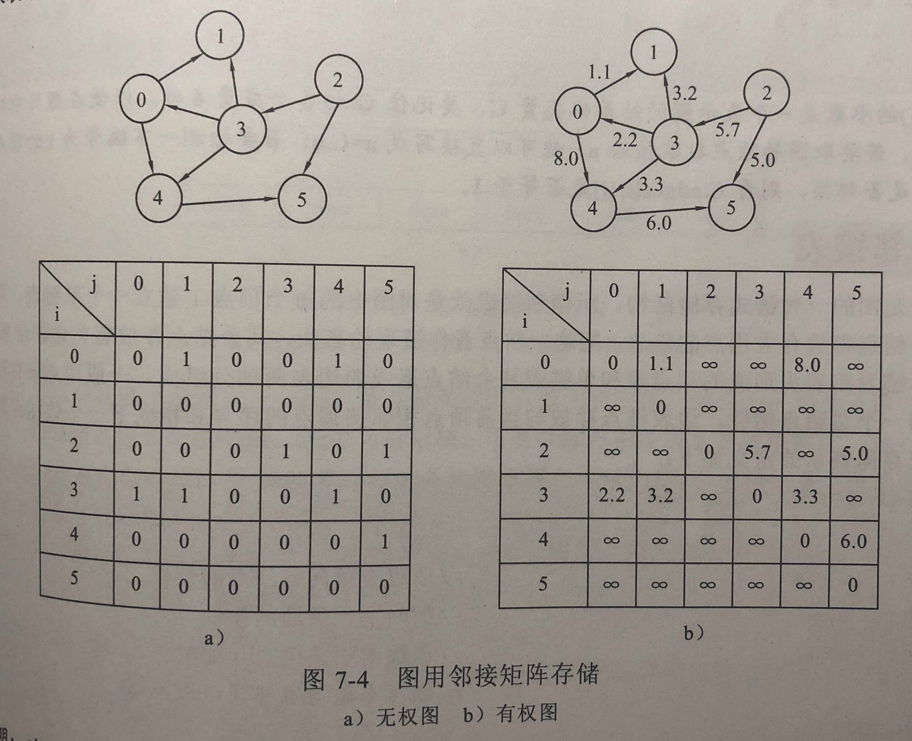
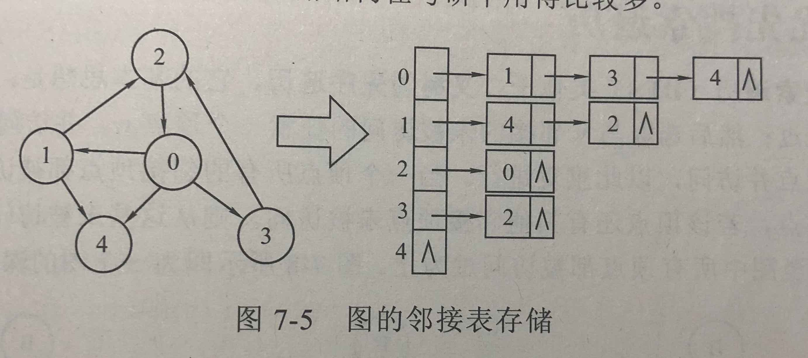
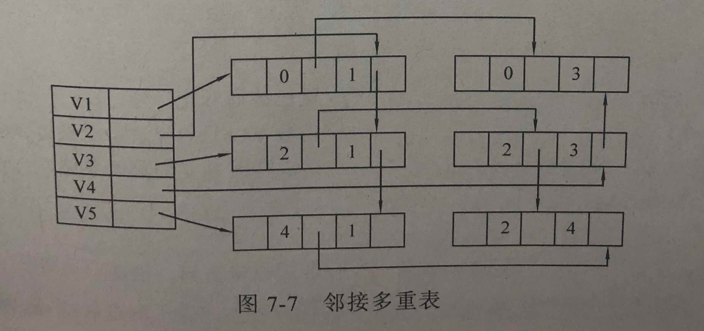
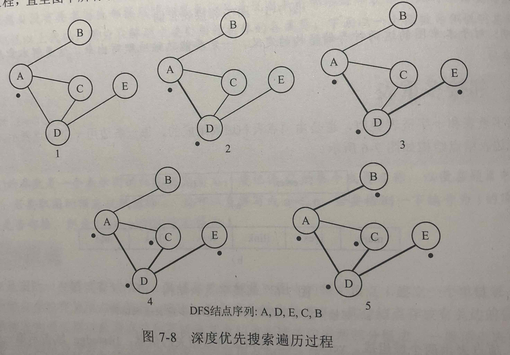
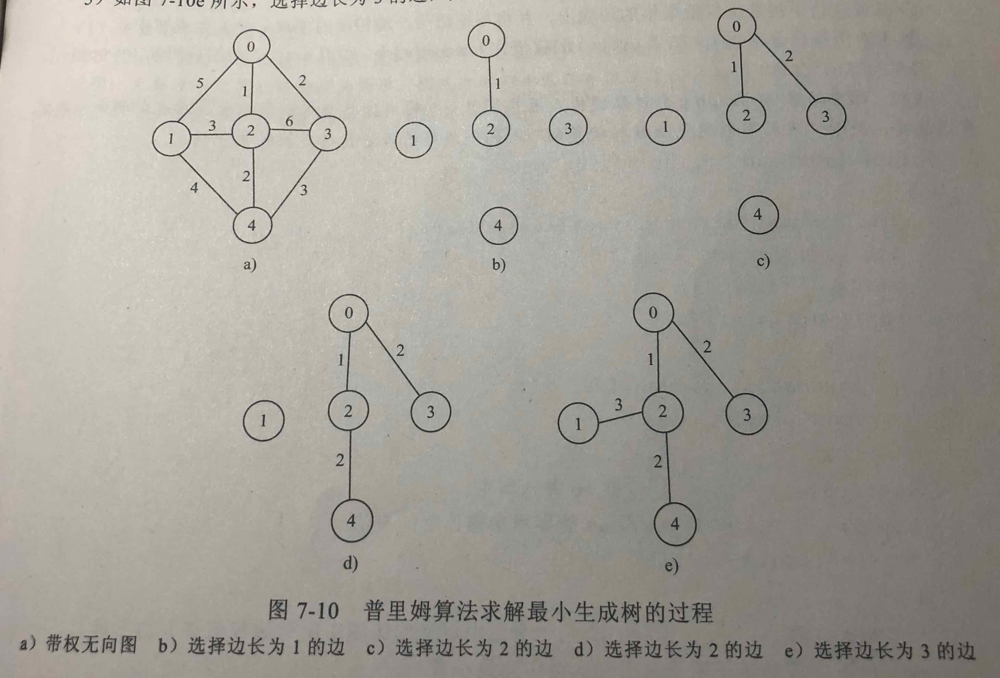
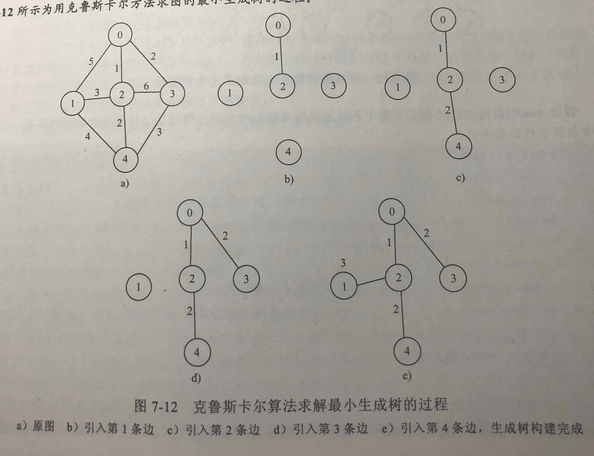

# 图

- [图](#%E5%9B%BE)
  - [图的基本概念](#%E5%9B%BE%E7%9A%84%E5%9F%BA%E6%9C%AC%E6%A6%82%E5%BF%B5)
  - [图的存储结构](#%E5%9B%BE%E7%9A%84%E5%AD%98%E5%82%A8%E7%BB%93%E6%9E%84)
  - [图的遍历算法操作](#%E5%9B%BE%E7%9A%84%E9%81%8D%E5%8E%86%E7%AE%97%E6%B3%95%E6%93%8D%E4%BD%9C)
  - [求最小（代价）生成树（无向图）](#%E6%B1%82%E6%9C%80%E5%B0%8F%EF%BC%88%E4%BB%A3%E4%BB%B7%EF%BC%89%E7%94%9F%E6%88%90%E6%A0%91%EF%BC%88%E6%97%A0%E5%90%91%E5%9B%BE%EF%BC%89)
  - [求某顶点到其他各顶点的最短路径](#%E6%B1%82%08%E6%9F%90%E9%A1%B6%E7%82%B9%E5%88%B0%E5%85%B6%E4%BB%96%E5%90%84%E9%A1%B6%E7%82%B9%E7%9A%84%E6%9C%80%E7%9F%AD%E8%B7%AF%E5%BE%84)
  - [拓扑排序](#%E6%8B%93%E6%89%91%E6%8E%92%E5%BA%8F)
  - [关键路径](#%E5%85%B3%E9%94%AE%E8%B7%AF%E5%BE%84)

## 图的基本概念

- 图，有向图和无向图，弧，顶点的度，入度，出度，有向完全图，无向完全图，路径，路径长度，简单路径，回路
- 连通，连通图，连通分量，强连通图，强连通分量，权，网

## 图的存储结构

- 顺序存储结构：邻接矩阵
  - 

- 链式存储结构：邻接表：每个结点一个链表，该链表记录该结点指向的各结点
  - 

- 邻接多重表：
  - 
  - 

## 图的遍历算法操作

- 深度优先搜索遍历（DFS）：类似于二叉树的先序遍历
  - 

- 广度优先搜索遍历（BFS）：类似于树的层次遍历

## 求最小（代价）生成树（无向图）

- 普里姆算法：任意取一个顶点，当成一棵树，从`与这棵树相接的边`中选取一条最短（权值最小）的边
  - 

- 克鲁斯卡尔算法：每次找出候选边中权值最小的边
  - 

## 求某顶点到其他各顶点的最短路径

- 迪杰斯特拉算法：待

- 弗洛伊德算法：待

## 拓扑排序

- AOV 网：Activity On Vertex network, 以顶点表示活动、以边表示活动的先后次序且没有回路的有向图。（边无权值）

- 拓扑排序核心算法：将所有顶点排成一个线性序列，并使得原前驱后继顺序不变

## 关键路径

- AOE 网：Activity On Edge network, 以顶点表示事件、以边表示活动，边有权值，代表活动持续时间。
  - 源点：入度为0的点，表示工程开始
  - 汇点：出度为0的点，表示工程结束
- 关键路径核心算法
  - 关键路径：从源点到汇点的所有路径中，具有最大路径长度的路径。它是图中的最长路径，又是整个工期所完成的最短时间。
  - 关键活动：关键路径上的活动。