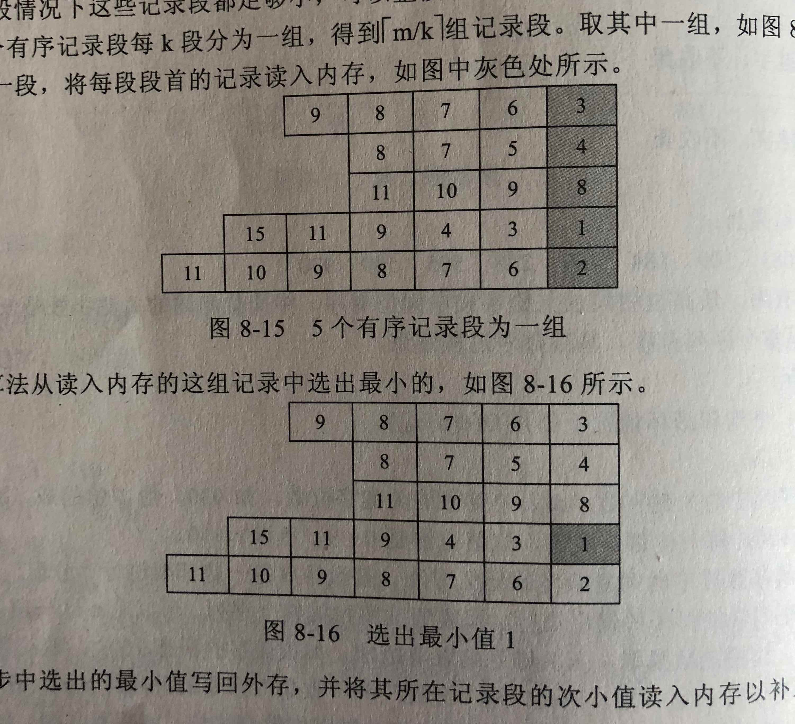
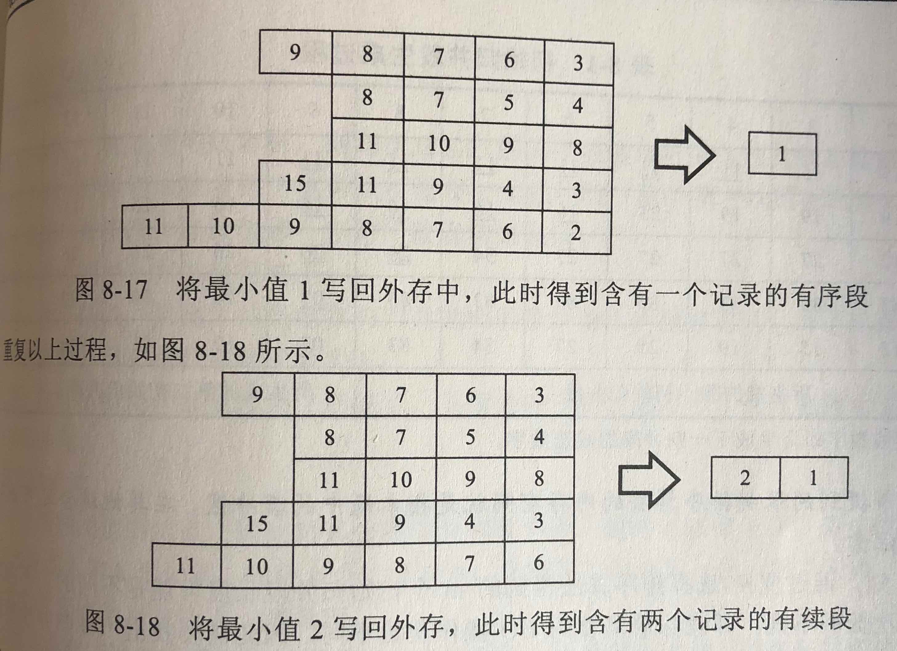
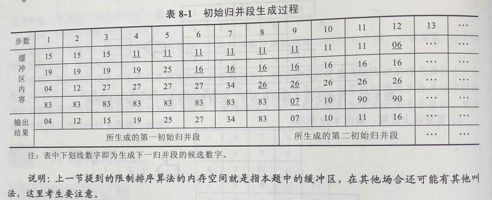
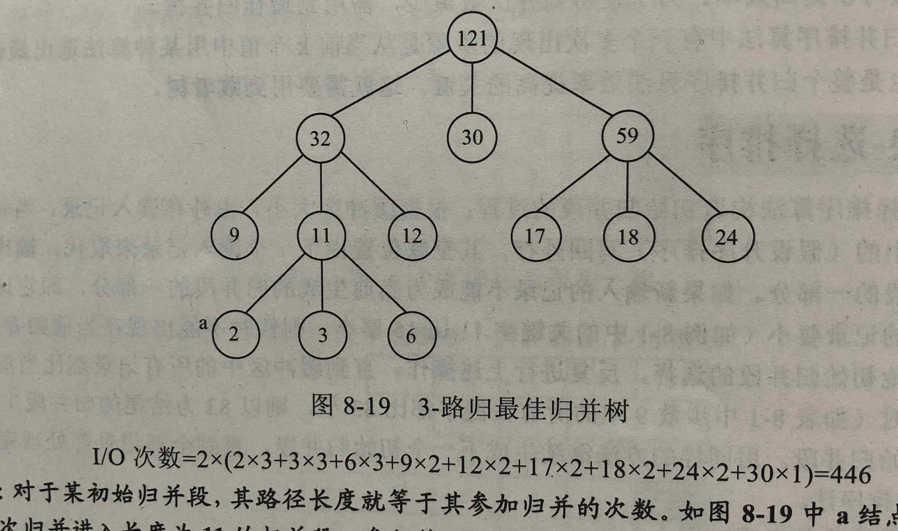
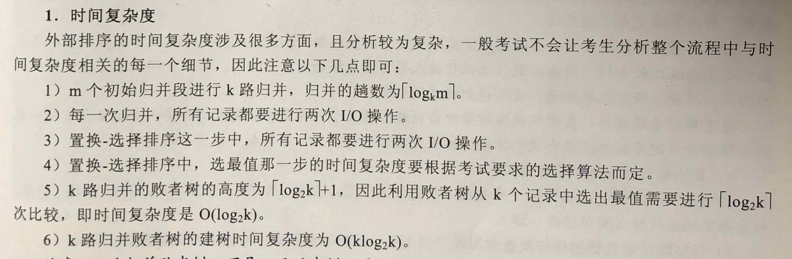

# 排序

- [排序](#%E6%8E%92%E5%BA%8F)
  - [排序的基本概念](#%E6%8E%92%E5%BA%8F%E7%9A%84%E5%9F%BA%E6%9C%AC%E6%A6%82%E5%BF%B5)
  - [插入类排序](#%E6%8F%92%E5%85%A5%E7%B1%BB%E6%8E%92%E5%BA%8F)
  - [交换类排序](#%E4%BA%A4%E6%8D%A2%E7%B1%BB%E6%8E%92%E5%BA%8F)
  - [选择类排序](#%E9%80%89%E6%8B%A9%E7%B1%BB%E6%8E%92%E5%BA%8F)
  - [二路归并排序](#%E4%BA%8C%E8%B7%AF%E5%BD%92%E5%B9%B6%E6%8E%92%E5%BA%8F)
  - [基数排序](#%E5%9F%BA%E6%95%B0%E6%8E%92%E5%BA%8F)
  - [外部排序](#%E5%A4%96%E9%83%A8%E6%8E%92%E5%BA%8F)
  - [排序知识点小结](#%E6%8E%92%E5%BA%8F%E7%9F%A5%E8%AF%86%E7%82%B9%E5%B0%8F%E7%BB%93)

## 排序的基本概念

- 排序：无序到有序
- 稳定性：对多个相同的关键字，在排序前后，其相对位置没有发生变化。
- 排序算法的分类：插入类，交换类，选择类，归并类，基数类

## 插入类排序

> 每趟把待排序的关键字`插入到`已经排好的部分有序序列的`适当位置`上

- 直接插入排序：采用逐个比较法查找插入位置
  - 时间复杂度：最好 $O(n)$ 最差 $O(n^2)$ 平均 $O(n^2)$
  - 空间复杂度：$O(1)$
- 折半插入排序：采用折半查找法查找插入位置
  - 时间复杂度：最好 $O(n\log_2n)$ 最差 $O(n^2)$ 平均 $O(n^2)$
  - 空间复杂度：$O(1)$
- 希尔排序（缩小增量排序）:按某种规则拆成子序列，分别进行直接插入排序
  - 时间复杂度：$O(n^2)$ 和 $O(n^{1.5})$
  - 空间复杂度：$O(1)$

## 交换类排序

> 通过一系列的“`交换`”动作完成

- 起泡排序(冒泡排序)：每趟第一个关键字向后逐个对比交换，结束的条件是在一趟排序中没有发生关键字交换
  - 时间复杂度：最好 $O(n)$ 最差 $O(n^2)$ 平均 $O(n^2)$
  - 空间复杂度：$O(1)$
- 快速排序：每趟选取一个枢轴，把所有比它小的放它左边，大的放它右边。然后对子序列依法同理。
  - 时间复杂度：最好 $O(n\log_2n)$ 最差 $O(n^2)$ 平均 $O(n\log_2n)$
  - 空间复杂度：$O(\log_2n)$

## 选择类排序

> 通过一系列的“`选择`”动作完成

- 简单选择排序：从头至尾找出最小的一个关键字，和第一个关键字交换
  - 时间复杂度：平均 $O(n^2)$
  - 空间复杂度：$O(1)$
- 堆排序：每趟将序列调整为堆，取根结点为最大
  - 时间复杂度：$O(n\log_2n)$
  - 空间复杂度：$O(1)$

## 二路归并排序

- 二路归并排序：两两归并，分别排序，反复如此操作
  - 时间复杂度：最好 $O(n\log_2n)$ 最差 $O(n\log_2n)$ 平均 $O(n\log_2n)$
  - 空间复杂度：$O(n)$

## 基数排序

- 基数排序：多关键字排序，序列中的每个元素是由多位字符（如3位数字）组成，先按每个元素的最低位排序，对结果按每个元素的中间位排序，对结果按每个元素的最高位排序。
  - 时间复杂度：$O(d(n+r_d))$  $n$ 序列中的关键字数；$d$ 关键字的关键字位数；$r_d$ 关键字的取值范围 如 930 取值范围是 0～9 所以 $r_d$ 为10
  - 空间复杂度：$O(r_d)$

## 外部排序

- 概念与流程
  - 将内存作为工作空间来辅助外存数据的排序
  - 归并排序：分成较小的子序列（$m$个初始归并段），分别排序，将各子序列的最小值写入内存，比较出最小值并写入外存，由原子序列的次小值补上空位，继续在内存中比较出最小值并写入外存，如此反复。
    - 
    - 
  - 概念
    - 初始归并段：一个有序记录段，称为一个初始归并段
    - 一趟归并：将当前的 $m$ 组（每组含有 $k$ 个有序记录段或初始归并段）记录归并为 $m$ 个有序记录段的过程
  - 重要子算法：置换-选择排序（优化初始归并段的生成），最佳归并树（优化一趟归并），败者树（优化选最值算法）

- 置换-选择排序：优化初始归并段的生成
  - 优化步骤一中的 $m$ 个初始记录段（或叫初始归并段）的生成，使得每个初始记录段中的记录个数不多也不少，可以在内存中对每个初始归并段内部先完成内排序。
  - 

- 最佳归并树：优化一趟归并，使次数最少
  - 归并过程可以用一棵树来描述，这棵树就是归并树。树中结点代表当前归并段长度。$I/O$次数$=$树的带权路径长度 $\times 2$. 归并策略不同，所得到的归并树也不同。
  - 用构造 $k$ 叉赫夫曼树的方法构造最佳归并树
  - 

- 败者树：优化选最值算法
  - 用败者树只需要$\log_2k$次就可以比较出最值

- 时间与空间复杂度相关问题
  - 
  - 空间复杂度：$O(1)$

## 排序知识点小结

- 稳定性：不稳定（快速排序，希尔排序，简单选择排序，堆排序）
- 排序算法的`关键字比较次数`和原始序列无关：简单选择排序，折半插入排序
- 排序算法的`排序趟数`和原始序列无关：交换类的排序