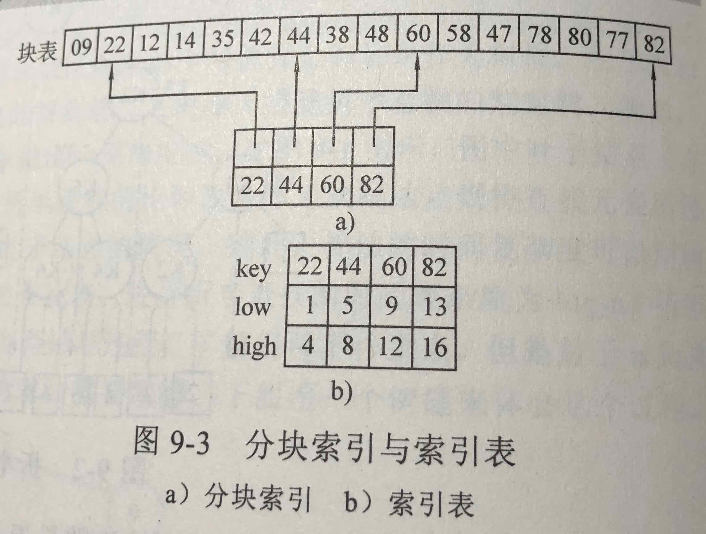
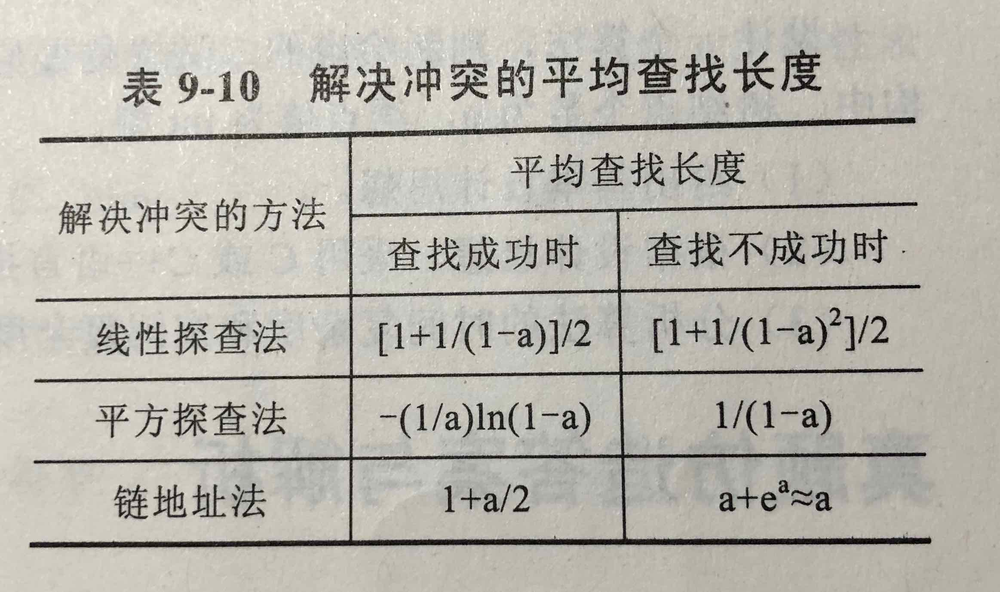

# 查找

## 基本概念

- 查找的基本概念
  - 决定查找方法的因素：查找表的数据结构，查找表中关键字的次序
  - 平局比较次数：$ASL=\sum_{i=1}^{n} p_i \times c_i$ $n$ 查找表中记录的个数  $p_i$ 查找第 $i$ 个记录的概率，一般取 $\frac {1}{n}$; $c_i$ 找到第 $i$ 个记录所需要进行比较的次数，即查找长度

- 顺序查找法：顺序扫描，依次比较
  - $ASL_1=\frac {(n+1)}{2}\qquad ASL_2=n$
  - 时间复杂度：均为 $O(n)$

- 折半查找法: 前提必须有序
  - 先判断中间，根据比对结果，选择一边继续判断中间，周而复始
  - 可以用二叉树来表示，即二叉排序树
  - 关键字个数相同的有序表可以产生同形的判定树

- 分块查找（索引顺序查找）
  - 先将线性表分块，块与块之间按照每块最大关键字排列。查找时，先用二次查分找到块，然后在块里做顺序查找
  - ASL = 二次查分ASL + 顺序查找ASL
  - 

## 二叉排序树与平衡二叉树

- 二叉排序树
  - 定义与存储结构：二叉排序树或者为空二叉树，或者为具有以下性质的二叉树：
    1. 若根结点的左子树不空，则左子树上所有结点的值都小于根结点的值；
    2. 若根结点的右子树不空，则右子树上所有结点的值都大于或者等于根结点的值
    3. 每一棵子树分别也是二叉排序树
  - 基本算法，见代码

- 平衡二叉树（AVL树）：基于二叉排序树，树越矮，查找效率越高，所以发明了平衡二叉树
  - 概念：一种特殊的二叉排序树。以树中所有结点为根的树的左右子树高度之差的绝对值不超过1
  - 平衡因子：一个结点的`平衡因子`为其左子树的高度减去右子树高度的差，只能有 -1 0 1
  - 建立：在建立一般二叉排序树的同时，随时做`平衡调整`
  - 平衡调整：LL型 RR型 LR型 RL型

## B- 树和 B+ 树

- B-树（B树）的基本概念
  - 多路搜索树，每个结点存储M/2到M个关键字，非叶子结点存储指向关键字范围的子结点；所有关键字在整颗树中出现，且只出现一次，非叶子结点可以命中；

- B-树的基本操作

- B+树的基本概念
  - 在B-树基础上，为叶子结点增加链表指针，所有关键字都在叶子结点中出现，非叶子结点作为叶子结点的索引；B+树总是到叶子结点才命中；

- B*树的基本概念
  - 在B+树基础上，为非叶子结点也增加链表指针，将结点的最低利用率从1/2提高到2/3；

## 散列表

- 散列表的概念：根据给定的关键字来计算出关键字在表中的地址

- 散列表的建立方法以及冲突解决方法
  - 常用建立方法：直接定址法，数字分析法，平方取中法，除留余数法
  - 常用冲突处理方法：开放定址法（线性探查法，平方探查法），链地址法

- 散列表的性能分析
  - 

## Reference

- [B树、B-树、B+树、B*树](http://www.cnblogs.com/oldhorse/archive/2009/11/16/1604009.html)