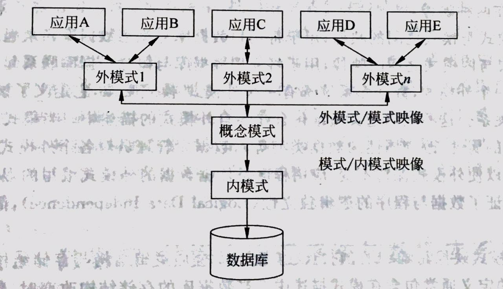
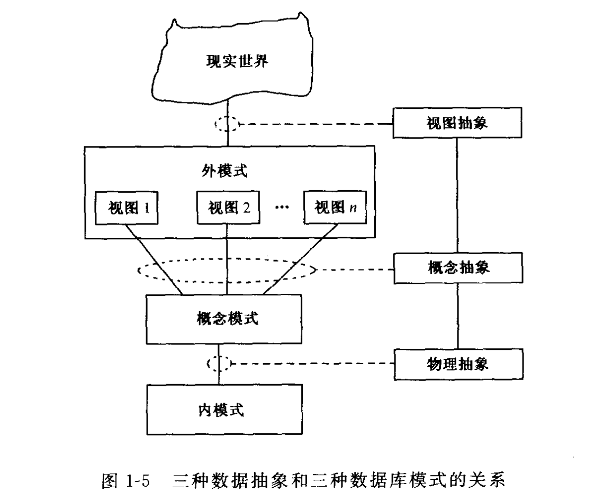
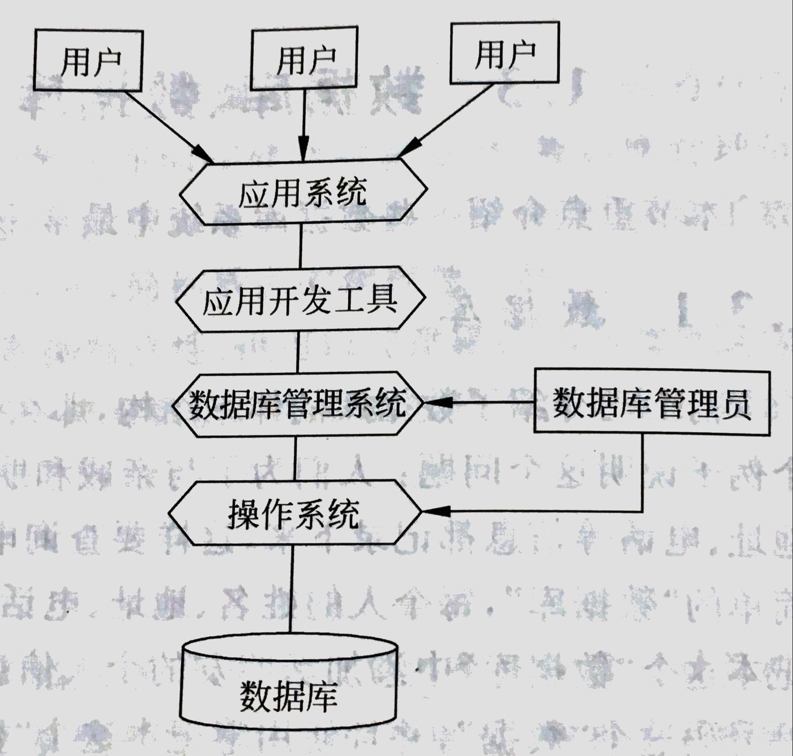

# 概览

- [概览](#%E6%A6%82%E8%A7%88)
  - [数据库系统的结构](#%E6%95%B0%E6%8D%AE%E5%BA%93%E7%B3%BB%E7%BB%9F%E7%9A%84%E7%BB%93%E6%9E%84)
    - [数据库三级模式](#%E6%95%B0%E6%8D%AE%E5%BA%93%E4%B8%89%E7%BA%A7%E6%A8%A1%E5%BC%8F)
    - [数据的三种抽象](#%E6%95%B0%E6%8D%AE%E7%9A%84%E4%B8%89%E7%A7%8D%E6%8A%BD%E8%B1%A1)
    - [数据库系统体系结构](#%E6%95%B0%E6%8D%AE%E5%BA%93%E7%B3%BB%E7%BB%9F%E4%BD%93%E7%B3%BB%E7%BB%93%E6%9E%84)
  - [名词解释](#%E5%90%8D%E8%AF%8D%E8%A7%A3%E9%87%8A)
  - [Reference](#reference)

## 数据库系统的结构

### 数据库三级模式

数据库系统的类型规模众多，但都遵循SPARC分级结构。三级数据模式体系结构设计思想大概是这样婶的：

- 模式：概念模式，也称逻辑模式，是数据库的总框架，是对数据库中全体数据的逻辑结构和特征的描述。概念模式不涉及物理存储，故称为DBA视图。

- 内模式：也称存储模式，是对数据物理结构和存储结构的描述。是数据在数据库内部的表示方式。一个数据库只有一个内模式。内模式是对数据库在物理存储器上具体实现的描述，规定数据在存储介质上的物理组织方式、记录寻址技术，定义物理存储块的大小、溢出处理方法等，与概念模式相对应。

- 外模式：也称子模式，通常是模式的一个子集。外模式面向用户，故称为用户视图。一个数据库可由多个外模式，属于概念模式的一个部分，用来描述用户数据结构、类型、长度等。

- 数据库的二级映像功能：三级模式中，只有内模式是真正存储数据的，模式和外模式只是一种表示数据的逻辑方法。这三种模式之间存在两种映像。

1. 外模式和模式之间的映像，用于将用户数据库和概念数据库联系起来。
2. 模式与内模式之间的映像，用于将物理数据库与概念数据库联系起来。

对于每一个外模式，数据库系统都有一个外模式－模式的映像，它定义了该外模式与模式之间的对应关系。模式－内模式映像是唯一的，它定义了数据库全局逻辑结构与存储结构之间的对应关系。当数据库存储结构改变时，数据库管理员对模式－内模式的映像作相应改变，模式保持不变，应用程序也不用改变，保证了程序和数据彼此的独立性，称为数据的物理独立性。

### 数据的三种抽象

- 视图抽象：把现实世界中的信息按照不同用户的观点抽象为多个逻辑数据结构。每个逻辑数据结构成为一个视图。所有视图的集合形成数据库的外模式。

- 概念抽象：把数据库的外模式抽象为数据库的概念模式。数据库的概念模式综合了外模式中的所有视图，反映所有数据库用户所关心的现实世界的抽象，形成数据库的整体逻辑结构。

- 物理抽象：把数据库的概念模式进一步抽象成为数据库的内模式。数据库的内模式抽象地描述概念数据库如何在物理存储设备上存储。数据库的内模式包括两个方面：一方面是存储策略的描述，包括数据和索引的存储方式、存储记录的描述、记录定位方法等。另一方面是存取路径的描述，包括索引的定义、hash 结构定义等。

### 数据库系统体系结构

当前的数据库，可分为以下几类：单用户数据库系统、主从式结构数据库系统、分布式结构数据库系统、Client-Server 结构数据库系统。

## 名词解释

- 数据库：DataBase，DB，为了实现一定的目的，按照某种规则组织起来的数据的集合。严格地讲数据库应该长期储存、有组织、可共享，数据按照一定的数据模型组织、描述、储存，具有较小的冗余，较高的数据独立性和易扩展性。

- 数据库管理系统：DataBase Management System，DBMS，为了保证存储在数据库中的数据安全和一致，由一组软件完成相应的管理任务。为用户提供访问数据库的数据和对数据的安全性、完整性、保密性、并发行等进行统一控制的方法。基本功能大致包括：数据定义、数据操纵、数据库运行管理、数据库建立与维护

- 数据库系统：DataBase System，DBS，在计算机系统中引入数据库后构成的计算机应用系统。DBS是实际可运行的存储、维护及可以为应用系统提供数据的软件系统，是存储介质、处理对象和管理系统的集合体，是以数据库方式管理大量共享数据的计算机系统。数据库系统具有以下特点：数据库的结构化、数据共享、可控冗余度

- 数据库管理员：DataBase Administrator，DBA，干活的人

## Reference

- [数据库学习笔记-00概览](http://blog.talisk.cn/blog/2016/01/01/DB-Learning-01-Overview/)