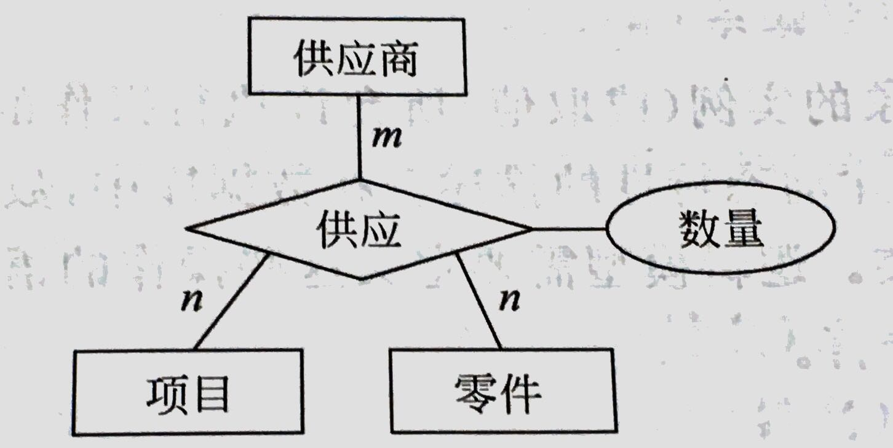

# 数据库学习笔记 - 数据模型

数据库系统操作处理的对象来自于现实的事物。在数据库中运用数据模型抽象、表示和处理现实世界中的信息和数据。

## 信息的三个世界

现实世界是客观世界

信息世界：

1. 实体 Entity：对象，Object。
2. 属性 Attributes：属性分型和值，型就是属性名，值是属性具体内容。比如『姓名：孙恺』，那么『姓名』就是属性的型，『孙恺』就是属性的值。
3. 实体型 Entity Type：若干属性组成的集合如『学生（学号，姓名，年龄，性别，系别）』。
4. 实体集 Entity Set：同型实体的集合，如所有的『学生』。
5. 键 Key：能唯一标识实体属性或属性集。
6. 域 Domain：属性值的取值范围。
7. 联系 Relationship

数据世界：

1. 字段 Field：对应于属性的数据，也称为数据项。
2. 记录 Record：对应于单个实体。
3. 文件 File：对应于实体集的数据称为文件。

### ER图

1. 矩形表示实体型。
2. 椭圆形表示属性。
3. 菱形表示联系。

用无向边连接起来，标明联系的类型。如图：

## 数据模型

- 基于对象的数据模型
  - 实体-联系模型
  - 面对对象的数据模型
- 基于记录的数据模型
  - 关系数据模型
  - 网络数据模型
  - 层次数据模型
- 物理数据模型
  - 一体化模型
  - 框架存储器模型

## Reference

- [数据库学习笔记-01数据模型](http://blog.talisk.cn/blog/2016/01/05/DB-Learning-02-Data-Model/)
