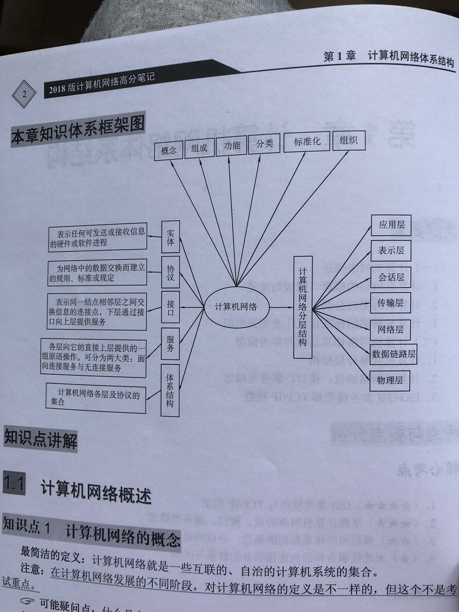

# 计算机网络体系结构

- [计算机网络体系结构](#%E8%AE%A1%E7%AE%97%E6%9C%BA%E7%BD%91%E7%BB%9C%E4%BD%93%E7%B3%BB%E7%BB%93%E6%9E%84)
  - [计算机网络概述](#%E8%AE%A1%E7%AE%97%E6%9C%BA%E7%BD%91%E7%BB%9C%E6%A6%82%E8%BF%B0)
  - [计算机网络体系结构与参考模型](#%E8%AE%A1%E7%AE%97%E6%9C%BA%E7%BD%91%E7%BB%9C%E4%BD%93%E7%B3%BB%E7%BB%93%E6%9E%84%E4%B8%8E%E5%8F%82%E8%80%83%E6%A8%A1%E5%9E%8B)

- 
- 

## 计算机网络概述

- 计算机网络的概念：互联 自治 集合

- 计算机网络的组成：物理组成（硬件、软件、协议），功能组成（通信子网、资源子网）

- 计算机网络的功能：数据通信、资源共享、分布式处理、信息综合处理、负载均衡、提高可靠性

- 计算机网络的分类
  1. 按分布范围：广域网、城域网、局域网、个人区域网
  2. 按拓扑结构：星形网、总线型网、环形网、网状形网
  3. 按传输技术：广播式网、点对点网
  4. 按使用者：公用网、专用网
  5. 按数据交换技术：电路交换网、报文交换网、分组交换网

- 计算机网络的标准化工作及相关组织
  1. 标准化步骤：因特网草案、建议标准、草案标准、因特网标准
  2. 相关组织：国际标准化组织 ISO、国际电信联盟 ITU、美国电气和电子工程师协会 IEEE

## 计算机网络体系结构与参考模型

- 计算机网络分层结构
  四层
  1. 实体：任何可以发送或接受信息的硬件或者软件进程，通常是一个特定的软件模块
  2. 对等层：不同机器上的同一层
  3. 对等实体：同一层上的实体

- 协议：控制两个对等实体进行通信的规则
  1. 语义：协议元素 含义 “讲什么”
  2. 语法：结构 格式 “怎么讲”
  3. 同步：执行顺序

- 接口：服务访问点。5个专业术语
  1. 服务数据单元 SDU
  2. 协议控制信息 PCI
  3. 接口控制信息 ICI
  4. 协议数据单元 PDU
  5. 接口数据单元 IDU

- 服务，分为三类
  1. 面向连接的服务（TCP 电话系统）和面向无连接的服务（IP UDP 邮政系统）
  2. 有应答的服务与无应答的服务
  3. 可靠服务与不可靠服务

- ISO/OSI 参考模型和 TCP/IP 参考模型

- 计算机网络性能指标
  1. 时延：总时延 = 发送时延 + 传播时延 + 处理时延 + 排队时延
  2. 时延带宽积（以比特为单位的链路长度）：时延带宽积 = 传播时延 * 带宽
  3. 往返时间：从发送方发送开始到发送方接收到反馈消息的时间
  4. 利用率：信道利用率 网络利用率
  - 信道利用率：某信道有百分之几的时间是被利用的（有数据通过）。完全空闲的信道的利用率为零。
  - 网络利用率：全网络的信道利用率的加权平均值。