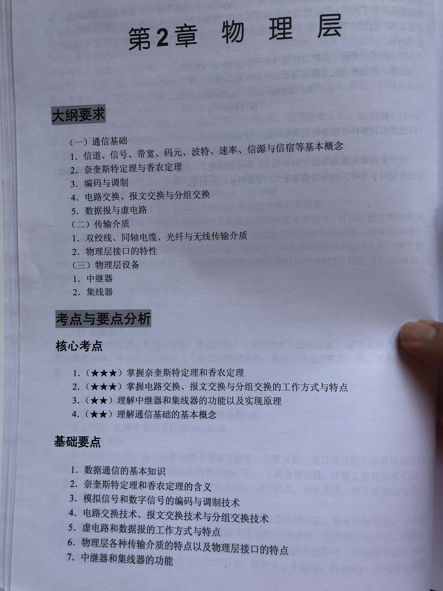
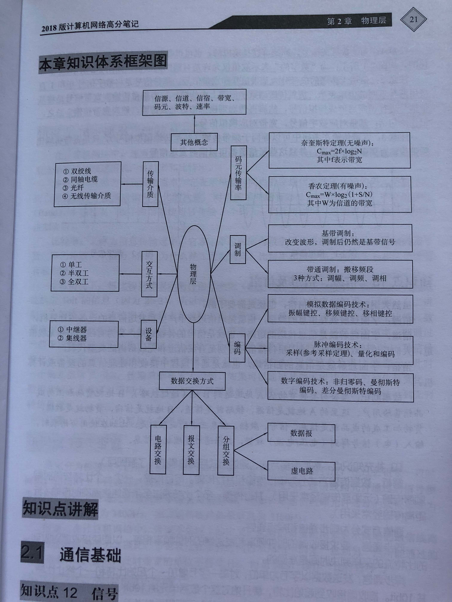
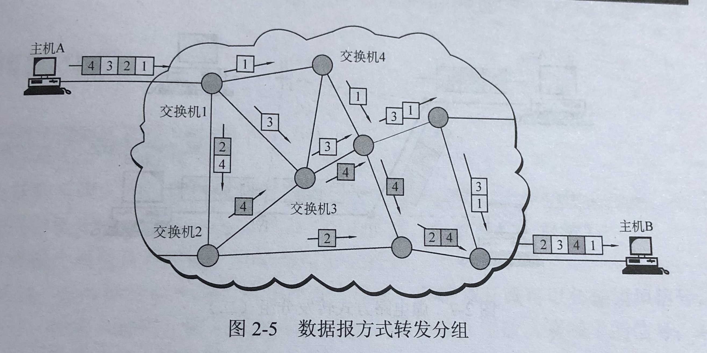
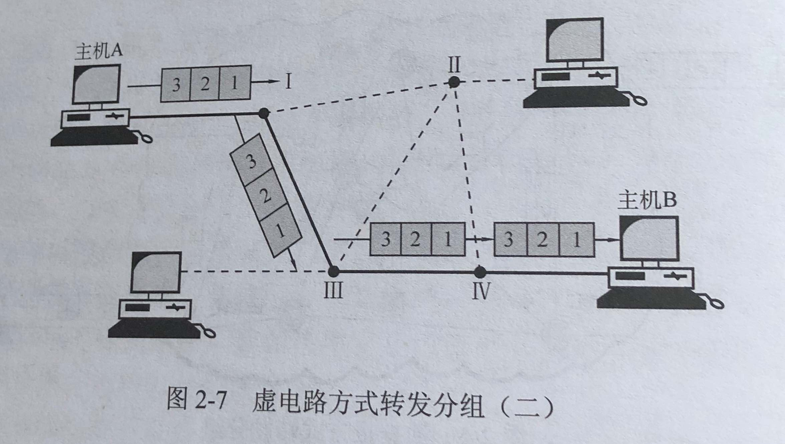
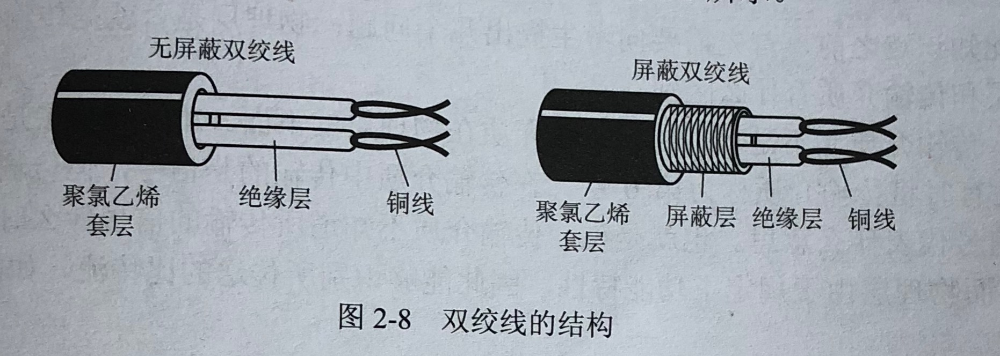
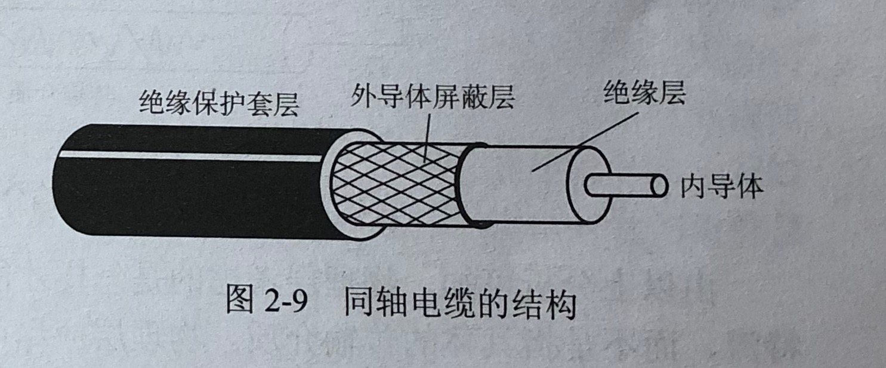
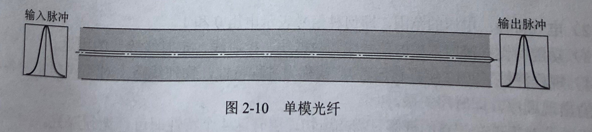
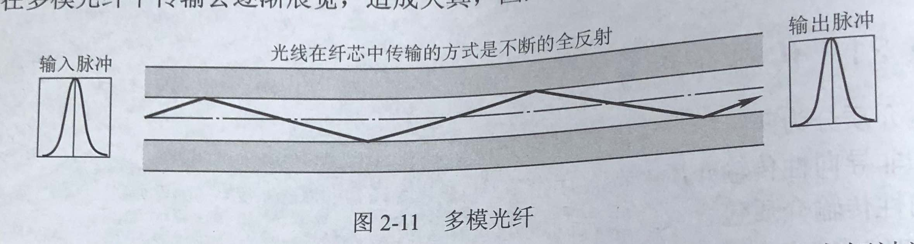
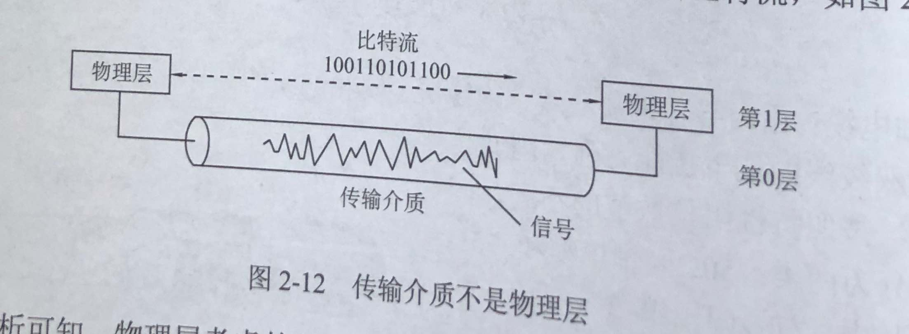

# 物理层

囊括所有涉及物理层面的事情：物理信号的传输、将物理信号转换到电平信号、物理传输方式、传输介质、物理接口约定、中继器、集线器

- [物理层](#%E7%89%A9%E7%90%86%E5%B1%82)
  - [通信基础](#%E9%80%9A%E4%BF%A1%E5%9F%BA%E7%A1%80)
  - [传输介质](#%E4%BC%A0%E8%BE%93%E4%BB%8B%E8%B4%A8)
  - [物理层设备，用于扩展](#%E7%89%A9%E7%90%86%E5%B1%82%E8%AE%BE%E5%A4%87%EF%BC%8C%E7%94%A8%E4%BA%8E%E6%89%A9%E5%B1%95)
  - [Reference](#reference)

- 
- 

## 通信基础

- 信号：某种形态和内容的数据

- 信源、信道和信宿：信息的发送地、传送道路、目的地

- 速率、波特及码元
  - 速率：单位时间内传输的数据量，有两种描述方式
  1. 波特(Baud)率：单位时间内的码元个数（脉冲个数、信号变化的次数）
  2. 比特率：单位时间内的二进制码元个数

- 带宽
  - 模拟信号的带宽：允许通过的最高频率减去最低频率，单位 Hz
  - 数字信号的带宽：网络通信线路所能传送数据的能力，单位 bit/s

- 奈奎斯特定理
  - 采样定理：采样频率大于被采样信号最高频率的两倍，就能完全恢复
    - 采样定理1928年由美国电信工程师H.奈奎斯特首先提出来的，因此称为奈奎斯特采样定理。1933年由苏联工程师科捷利尼科夫首次用公式严格地表述这一定理，因此在苏联文献中称为科捷利尼科夫采样定理。1948年信息论的创始人C.E.香农对这一定理加以明确地说明并正式作为定理引用，因此在许多文献中又称为香农采样定理
    - 直观解释：你想象一个白色的圆盘，有一条沿着半径的黑线，圆盘以角速度\omega 旋转。你以一定的周期拍照，就是采样。你拍照的频率恰好为圆盘自转频率两倍的时候，你的照片里黑线的位置，永远是下一张和上一张呈180度，看不出圆盘原来到底是顺时针转的还是逆时针转的。
  - 奈奎斯特定理
    - 码间串扰：速度=波长*频率，信道的最大频率界限会截去被传输波的频率峰值，导致码元之间没有最大峰值，使得码元之间失去了清晰界限。
    - 码元的最大传输速率：Cmax=2×B×log2L 这里Cmax指的是理想低通信道的最大容量，B是理想低通信道的带宽，L是每个码元的离散电平个数

- 香农定理
  - 奈奎斯特定理适用的情况是无噪声信道，用来计算理论值。一根针掉在地上还有声音呢，没有噪声的信道在现实中是不存在的。那么有噪声的信道该如何计算呢？
  - 信噪比(dB)：信号的平均功率和噪声的平均功率之比 10log10(S/N)
  - 码元的最大传输速率：Cmax=B×log2（1+（S/N）） S/N指的是信道的信噪比，但是我们一般测量出来的以db为单位的是经过10×log10（S/N）换算的，所以这里还要换算回来才行

- 编码与调制
  - 编码：数据转换为数字信号的过程
    - 数字数据 -> 数字信号
    - 模拟数据 -> 数字信号
  - 调制：数据转换为模拟信号的过程
    - 数字数据 -> 模拟信号
    - 模拟数据 -> 模拟信号

- 数据传输方式，三种
  1. 电路交换：建立一条被双方独占的物理通路
  2. 报文交换：在交换结点存储转发
  3. 报文分组交换：将分割后的分组报文在交换结点存储转发，可以分为面向连接的虚电路方式和无连接的数据报方式。

- 数据报与虚电路

  - 数据报：通过多个交换机和各自的转发表，转发被分组的报文
  - 

  - 虚电路：先指定多个交换机，转发被分组的报文，然后释放
  - 

## 传输介质

- 传输介质分类

  - 导向性传输介质（实在的线）
  1. 双绞线
  
  2. 同轴电缆
  
  3. 光纤
  
  

  - 非导向性传输介质（空间传播）：短波、微波、红外线、可见光

- 物理层接口特性

  - 
  - 机械特性：接口的形状、尺寸、引线数目、排列，确保和电器连接
  - 电气特性：用何种信号表示电压1和0
  - 功能特性：接口部件的数据线、控制线、定时线的用途
  - 规程特性：物理线路上对不同功能的各种可能事件的出现顺序，即时许关系

## 物理层设备，用于扩展

- 中继器

  - 作用：放大信号，继续传送，非屏蔽双绞线，超过100米安装一个
  - “放大器”放大模拟信号，“中继器”放大数字信号

- 集线器 Hub

  - 多端口的中继器  RJ45 接口

## Reference

- [如何理解Nyquist采样定理？](https://www.zhihu.com/question/24490634)
- [理解奈奎斯特定理和香农定理](http://blog.csdn.net/supreme42/article/details/7734763)
- [《计算机网络》这门课为何如此之难？](https://www.zhihu.com/question/19718686/answer/185348786)