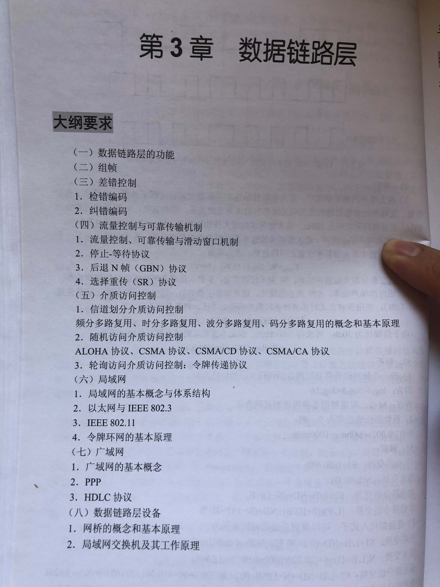
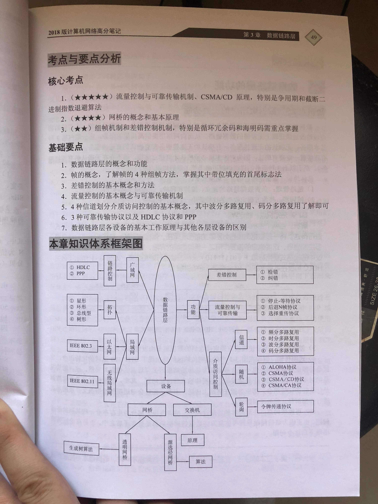
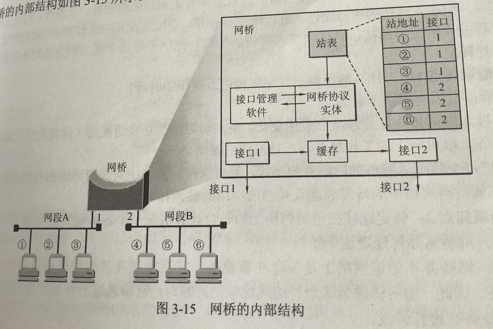
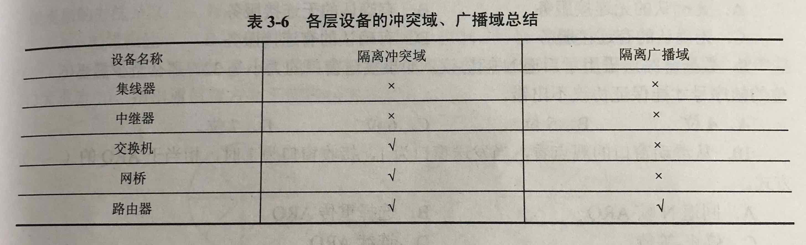

# 数据链路层

主要讨论在数据链路上帧流的传输问题：将数据（01串）整理成数据块(组帧)、对数据（01串）检错纠错、介质访问控制、局域网MAC寻址、广域网IP分配、网桥、（局域网）交换机

- [数据链路层](#%E6%95%B0%E6%8D%AE%E9%93%BE%E8%B7%AF%E5%B1%82)
  - [数据链路层的功能](#%E6%95%B0%E6%8D%AE%E9%93%BE%E8%B7%AF%E5%B1%82%E7%9A%84%E5%8A%9F%E8%83%BD)
  - [组帧](#%E7%BB%84%E5%B8%A7)
  - [差错控制](#%E5%B7%AE%E9%94%99%E6%8E%A7%E5%88%B6)
  - [介质访问控制](#%E4%BB%8B%E8%B4%A8%E8%AE%BF%E9%97%AE%E6%8E%A7%E5%88%B6)
  - [局域网](#%E5%B1%80%E5%9F%9F%E7%BD%91)
  - [广域网](#%E5%B9%BF%E5%9F%9F%E7%BD%91)
  - [数据链路层设备，用于扩展](#%E6%95%B0%E6%8D%AE%E9%93%BE%E8%B7%AF%E5%B1%82%E8%AE%BE%E5%A4%87%EF%BC%8C%E7%94%A8%E4%BA%8E%08%E6%89%A9%E5%B1%95)
  - [Reference](#reference)

- 
- 

## 数据链路层的功能

- 数据链路层的主要功能
  - 链路管理：数据链路（数据传输内部通道）的建立、维持和释放，主要用于面向连接的服务。
  - 帧同步：把数据分装成帧（数据块）
  - 差错控制：控制差错
  - 透明传输：不论什么帧都能在数据链路上传送

## 组帧

- 4种组帧方法：将一段数据（0 1 串）的前后分别添加首部和尾部，就构成了帧，有四种组帧方法
  - 字符计数法：用一个特殊字符表示一帧的开始，用一个计数字段表示该帧包含的字节数
  - 字节填充的首尾界符法：用一些特定的字符来定界一帧的起始与终止
  - 比特填充的首尾标志法：用一些特定的比特来定界一帧的起始与终止
  - 物理编码违例法：利用物理介质上编码的违法标志来区分帧的开始与结束

## 差错控制

- 检错编码
  1. 奇偶校验码：加一个校验码后，有 奇数个1 或 偶数个1，用以校验；检错率极低。
  2. 循环冗余码 CRC：在数据单元末尾加一串冗余位，称作循环冗余校验码或循环冗余校验余数，使得整个数据单元可以被另一个预定的二进制数所整除

- 纠错编码
  - 海明码（汉明吗）：在数据串（01）中插入若干位 bit 数据
  - 一个 k 位01串，需要 r 位海明码：2^r >= k+r+1

## 介质访问控制

在局域网中，一个信道供多个输入或多个输出共同使用。如果在多个输入或多个输出之间分配信道的使用权？

- 介质访问控制方式的分类：信道划分介质访问控制、随机访问介质访问控制、轮询访问介质访问控制

- 信道划分介质访问控制（`静态分配信道`）
  - 多路复用：在一条介质上同时传输多个传输信号，无论是多个输入还是多个输出
  - 频分多路复用：将一条信道分割成多条不同频率的信道，不同频率的信号在不同频率的信道里传送
  - 时分多路复用：将一个固定的时间分割成若干段，不同的信号在不同的时间间隔内传送
    - 同步时分复用：严格按照时间段，必须到时使用
    - 异步时分复用（统计时分复用）：按时间段，依次轮流使用，动态时间分配
  - 波分多路复用：光的频分多路复用。在一根光纤中传输不同频率的光信号，最后用分波器将各个光信号分解出来
  - 码分多路复用（码分多址 CDMA）：既共享信道频率，又共享时间，真正的动态复用技术。`CDMA技术的原理是基于扩频技术，即将需传送的具有一定信号带宽信息数据，用一个带宽远大于信号带宽的高速伪随机码进行调制，使原数据信号的带宽被扩展，再经载波调制并发送出去。接收端使用完全相同的伪随机码，与接收的带宽信号作相关处理，把宽带信号换成原信息数据的窄带信号即解扩，以实现信息通信。`

- 随机访问介质访问控制（`动态分配信道`）：通过争用，胜利者才能获得信道，因而又叫“争用型协议”

  1. ALOHA 协议：只要用户有数据要发送，就尽管让他们发送。当然，这样会产生冲突从而造成帧的破坏。但是，由于广播信道具有反馈性，因此发送方可以在发送数据的过程中进行冲突检测，将接收到的数据与缓冲区的数据进行比较，就可以知道数据帧是否遭到破坏。同样的道理，其他用户也是按照此过程工作。如果发送方知道数据帧遭到破坏（即检测到冲突），那么它可以`等待一段随机长的时间后重发该帧`。

  2. CSMA 协议：载波监听多路访问协议。“`先听（空闲）后发`”

  3. CSMA/CD 协议：带冲突检测的载波监听多路访问协议。局域网中广泛应用。“`先听后发，边听边发，冲突停发，随机重发`”

  4. CSMA/CA 协议: “`先听后发, 发完等反馈确认，无误再发，有误重发`”

- 轮询访问介质访问控制（`动态分配信道`）：主要用于令牌环局域网
  - 令牌传递协议：令牌只有一个

## 局域网

- 局域网的基本概念与体系结构
  1. 最主要的特点：小范围，有限站点，数据率较高，时延较低，误码率较小
  2. 主要优点：广播，可扩展，高可用
  3. 主要技术要素：网络拓扑结构、传输介质与介质访问控制方法
  4. 主要拓扑结构：星形网、环形网、总线型网、树形网
  5. 主要传输介质：双绞线、铜缆、光纤
  6. 主要介质访问控制方法：CSMA/CD，令牌总线，令牌环

- 以太网的工作原理：总线拓扑结构，广播，CSMA/CD，无连接方式，数据帧不编号不确认
  - 以太网是目前最成功的局域网产品，现在以太网几乎成了局域网的代名词。

- 以太网的MAC帧
  - mac地址、物理地址、硬件地址：网卡的唯一编号
  - 网卡每收到一个 mac 帧，先要检查 mac 帧中的 mac 地址，是则收下，否则丢弃

- 以太网的传输介质：粗缆，细缆，双绞线，光纤

- 高速以太网：>= 100Mbit/s 的以太网
  1. 100Base-T 以太网：双绞线，星形拓扑结构，CSMA/CD
  2. 吉比特以太网（千兆以太网）：CSMA/CD
  3. 10 吉比特以太网

- 无线局域网：标准协议 IEEE 802.11
  1. 无线局域网的组成：有固定基础设施，无固定基础设施
  2. IEEE 802.11 标准中的物理层：调频扩频，直接序列扩频，红外线
  3. IEEE 802.11 标准中的 MAC 层：CSMA/CA

- 令牌环网的工作原理
  - 最有影响的令牌环网是 Token Ring
  - 物理环形
  - 令牌：MAC 控制帧，帧中有一位标志令牌（忙/闲）

## 广域网

- 广域网的基本概念：长距离网络，PPP 点对点协议

- PPP 点对点协议：面向字节
  1. 3个组成部分：一个将IP数据报封闭到串行链路的方法，一个用来建立、配置和测试数据链路连接的链路控制协议（Link Control Protocol，LCP），一套网络控制协议（Network Control Protocol，NCP）。
  2. PPP 的帧格式：组帧时，按照 PPP 的帧格式组帧
  3. PPP 的工作状态：用户拨号进入ISP `->` 路由器调制解调器确认并建立物理连接 `->` 个人计算机发送 LCP 分组给路由器 `->` NCP 分配 IP 地址给新接入的个人计算机 `->` 个人计算机成为广域网上的一个主机 `->` 通信完毕 `->` NCP 释放网络层连接 `->` 收回 IP 地址 `->` LCP 释放数据链路层连接 `->` 释放物理层连接

- HDLC 协议（高级数据链路控制）：面向比特
  1. 基本特点：面向比特，平衡配置 非平衡配置
  2. 帧格式：比 PPP 帧少一个 2 字节的协议字段，和 PPP 相比，使用了编号和确认机制

## 数据链路层设备，用于扩展

- 网桥的概念和基本原理
  - 
  - 功能：用于`在不同网段之间`的数据帧传递、帧过滤
  - 优点：过滤通信量，扩大物理范围，提高可靠性，可互联不同物理层、mac子层、速率的以太网
  - 缺点：增加时延、无流量控制、广播风暴（传播过多的广播信息而产生网络拥塞）

- 网桥的分类
  - 透明网桥（选择的不是最佳路由）：一种即插即用设备，只需把它接入局域网，不用人工配置转发表
  - 源选径网桥（选择的是最佳路由）：这种网桥根据数据帧中的路由信息对帧进行接收和转发

- 局域网交换机及其工作原理
  - 基本概念：多端口网桥
  - 两种交换模式：直通式交换、存储转发式交换
  - 工作原理：帧的源 MAC 地址和目的 MAC 地址 `->` 动态查找表 `->` 发送数据报

- 各层设备的广播域、冲突域及总结
  - 广播域：能收到一个广播的所有网卡的集合，一个局域网就是一个广播域
  - 冲突域：有可能冲突的网卡就构成冲突域，一个网段就是一个冲突域
  - 

## Reference

- [计算机网络教程之数据链路层](https://zhuanlan.zhihu.com/p/23058522)
- [PPP协议详解及举例](https://wenku.baidu.com/view/118ad274580216fc700afd5f.html)