# 网络层

计算路由，转发IP数据报，路由器

- [网络层](#%E7%BD%91%E7%BB%9C%E5%B1%82)
  - [网络层的功能](#%E7%BD%91%E7%BB%9C%E5%B1%82%E7%9A%84%E5%8A%9F%E8%83%BD)
  - [路由算法](#%E8%B7%AF%E7%94%B1%E7%AE%97%E6%B3%95)
  - [IPv4](#ipv4)
  - [IPv6](#ipv6)
  - [路由协议](#%E8%B7%AF%E7%94%B1%E5%8D%8F%E8%AE%AE)
  - [IP组播](#ip%E7%BB%84%E6%92%AD)
  - [移动IP](#%E7%A7%BB%E5%8A%A8ip)
  - [网络层设备](#%E7%BD%91%E7%BB%9C%E5%B1%82%E8%AE%BE%E5%A4%87)
  - [Reference](#reference)

- 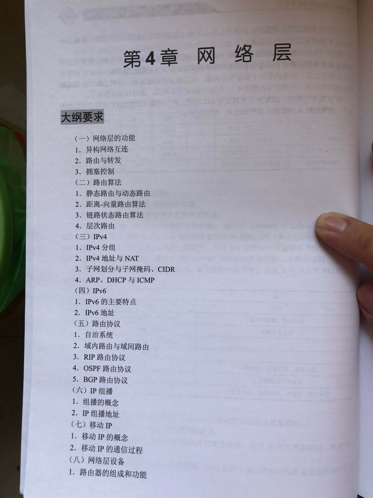
- 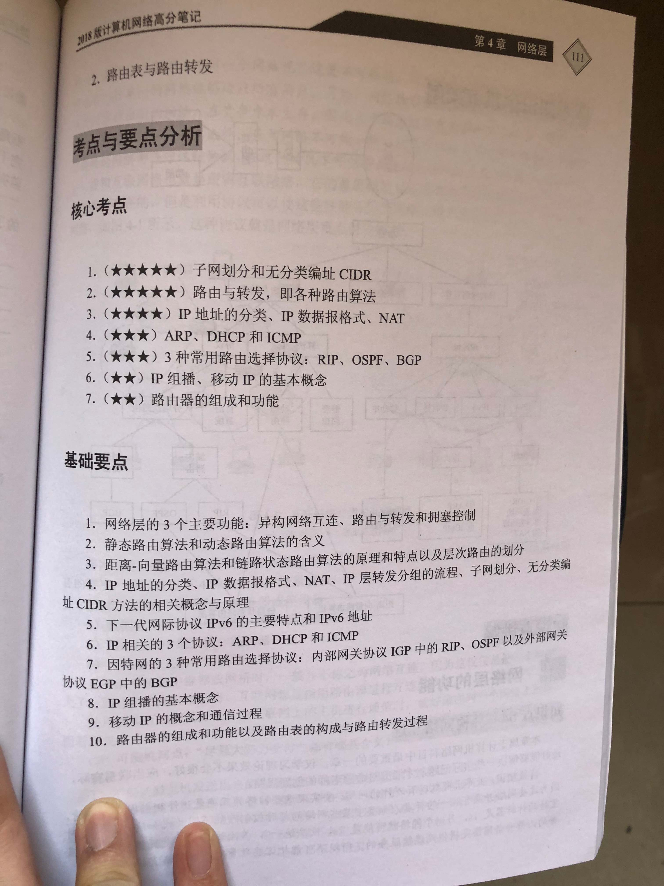
- 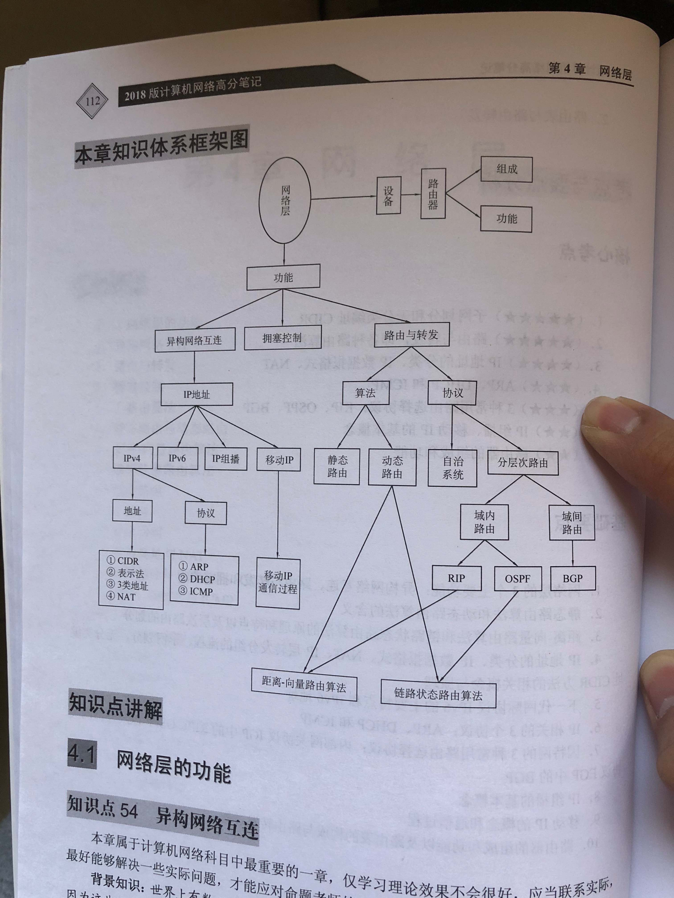

## 网络层的功能

- 异构网络互连：使物理异构的各种网络互连到一起
- 路由与转发：计算路由，转发数据报
- 拥塞控制：不出现拥塞，或出现拥塞时良好
  - 开环控制
  - 闭环控制

## 路由算法

- 静态路由与动态路由
  - 静态路由（非自适应路由选择）：手动配置路由
  - 动态路由（自适应路由选择）：动态路由选择算法，共两类：距离-向量路由算法、链路状态路由算法

- 距离-向量路由算法：通过迭代法计算出最短通路，常用：RIP 算法

- 链路状态路由算法：使用结点状态图、Dijkstra 计算出最短通路，常用 OSPF 算法

- 层次路由
  - 路由选择协议两大类：内部网关协议 IGP 域内路由选择（有 RIP OSPF），外部网关协议 EGP 域间路由选择（有 BGP）
  - OSPF 划分区域：骨干区域（0.0.0.0）骨干路由器 区域边界路由器

## IPv4

- IPv4 分组：
  - 数据报：是通过网络传输的数据的基本单元
  - IP 数据报 (IP Datagram)：TCP/IP 协议定义的传输的包
  - IP 数据报格式
  - 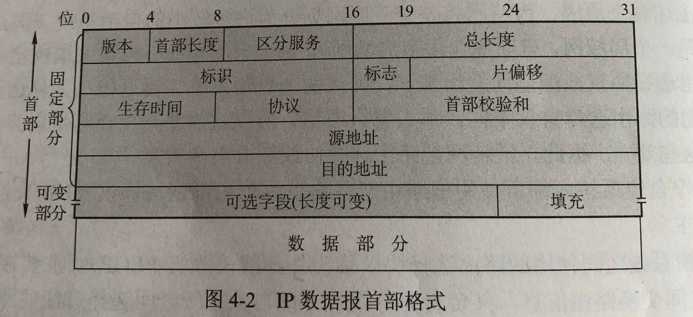

- IPv4 地址

  - IPv4 地址的分类: IP地址：32位标识符
    1. A 类地址: 0000001.00000000.00000000.00000000 - 01111110.00000000.00000000.00000000  (1 ~ 126)
    2. B 类地址: 10000000.00000001.00000000.00000000 - 10111111.11111111.00000000.00000000  (128.1 ~ 191.255)
    3. C 类地址: 11000000.00000000.00000001.00000000 - 11011111.11111111.11111111.00000000 (192.0.1 ~ 223.255.255)

  - 6 种特殊地址
  - 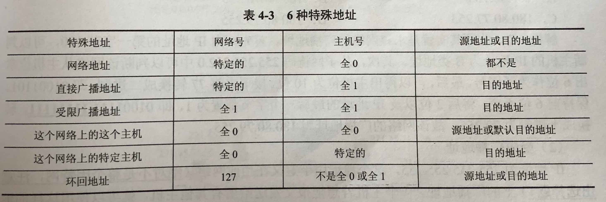

- NAT

  - 专用地址: 路由器检测到数据包中有此地址则不进行转发工作，形成专用互联网（本地互联网、专用网）
  1. 子网掩码为 255.0.0.0 的 10.0.0.0  （10.0.0.0 - 10.255.255.255）
  2. 子网掩码为 255.240.0.0 的 172.16.0.0  （172.16.0.0 - 172.31.255.255）
  3. 子网掩码为 255.255.0.0 的 192.168.0.0  （192.168.0.0 - 192.168.255.255）

  - NAT：将专用网内部使用的本地 IP 地址转换成有效的外部全球 IP 地址，使得整个专用网只需要一个全球 IP 地址就可以与因特网连通。

- 子网划分与子网掩码

  - 子网划分：路由器根据目的网络地址和子网地址找到目的子网
  - 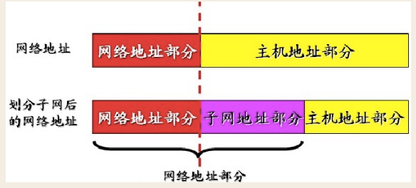

  - 子网掩码
  1. 子网掩码用于识别ip地址中的网络地址和主机地址。
  2. 子网掩码也是32位二进制数字，在子网掩码中，对应于网络地址部分全用1表示，主机部分全用0表示
  3. 还可以用网络前缀表示子网掩码，即"／<网络地址位数>"，如172.16.45.0/24表示B类网络172.16.45.0的子网掩码为255.255.255.0
  4. 不管网络有没有划分子网，只要将子网掩码和IP地址进行诸位的“与”运算，就一定能立即得出网络地址
  - 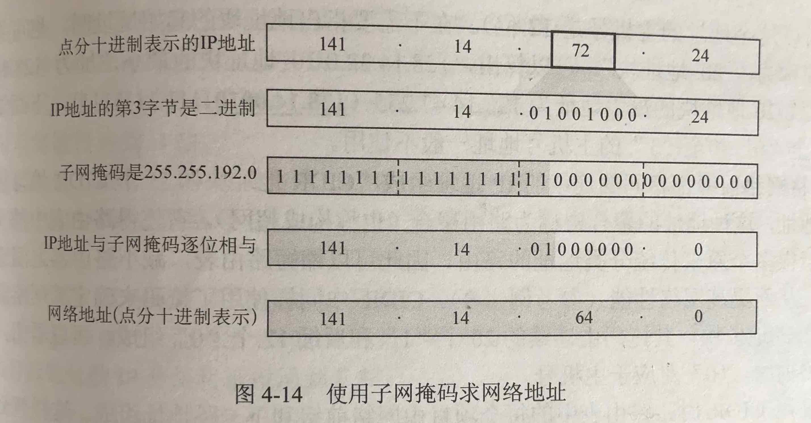

- CIDR
  - 不同于子网划分的方法的 IP 寻址方式，CIDR (无分类编址)是另一种 IP 寻址方式
  - CIDR技术用子网掩码中连续的1部份表示网络ID，连续的0部份表示主机ID。比如，网络中包含2000台计算机，只需要用11位表示 主机ID，用21位表网络ID，则子网掩码表示为11111111.11111111.11100000.00000000，转换为十进制则为 255.255.224.0。此时，该网络将包含2046台计算机，既不会造成IP地址的浪费，也不会利用路由器连接网络，增加额外的管理维护量。
  - CIDR表示方法：IP地址/网络ID的位数，比如192.168.23.35/21，其中用21位表示网络ID。
  - 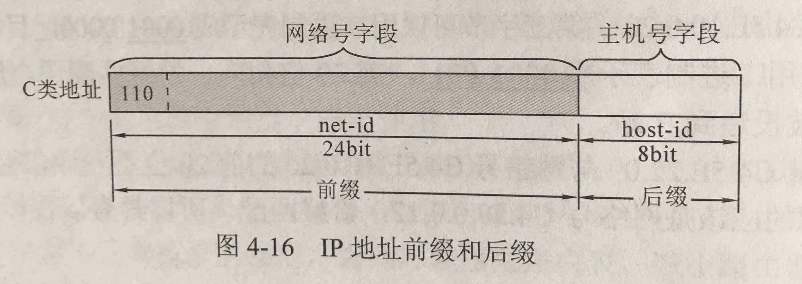

- ARP: 自动地将 IP 地址解析为链路层所需要的硬件地址
  - ARP 请求分组是广播，ARP 响应分组是普通的单播
  - 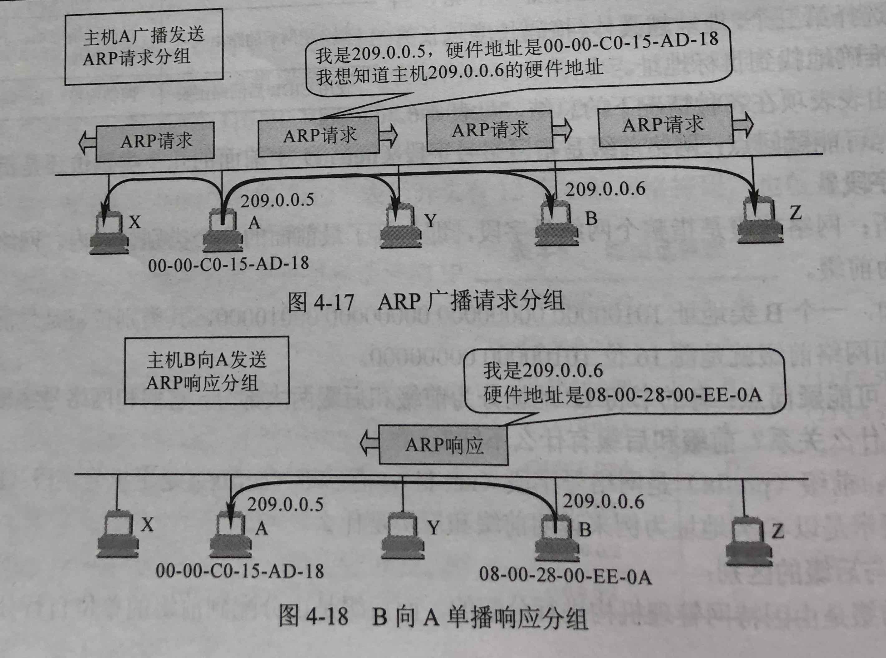

- DHCP 动态主机配置协议：给主机动态地分配 IP 地址
  - DHCP 是应用层协议，使用 UDP 传输，使加入新网络的计算机自动获取到 IP 地址。
  - 临时分配，租用期

- ICMP：主要用于在主机与路由器之间传递控制信息，包括报告错误、交换受限控制和状态信息等。
  - TCP/IP协议族的一个子协议
  - 两种：ICMP 差错报告报文，ICMP 询问报文

## IPv6

- IPv6 的特点：128位（IPv4:32位），多层，首部8段（IPv4:12段），改进的选项，允许协议扩充，即插即用，预分配，首部长度是8B的整数倍（IPv4:4B）

- IPv6 的格式
  - 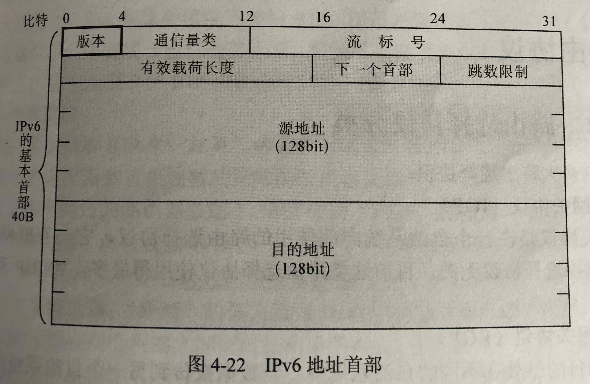
  - 地址类型：单播，组播，任播

## 路由协议

- 路由选择协议分类
  - 内部网关协议（IGP）: RIP, OSPF
  - 外部网关协议（EGP）: BGP-4
  - 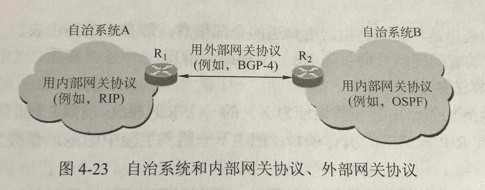

- RIP
  - 距离-向量算法
  - RIP 报文格式
  - RIP 的优缺点

- OSPF
  - 链路状态协议
  - OSPF 的 5 种分组类型

- RIP 与 OSPF 的比较
- BGP
- RIP OSPF BGP 最终陈述
  - 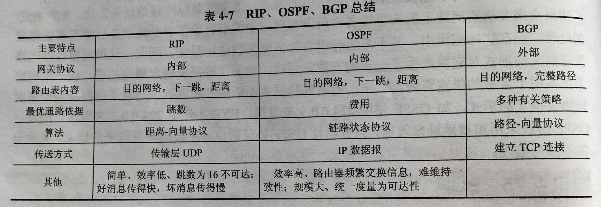
  - 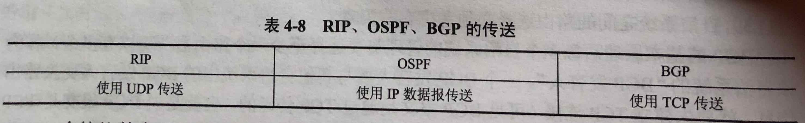

## IP组播

- 组播的概念：源主机只发送一份数据，该数据中的目的地址为组播的组地址。组地址中的所有接收者都可以接收到同样的数据副本
  - 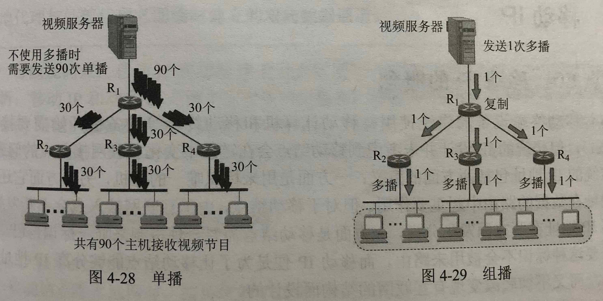

- IP 组播地址: D 类地址（前缀 1110）：224.0.0.0 - 239.255.255.255

- 组播地址与 MAC 地址的换算

## 移动IP

- 移动 IP 的概念：以固定的网络IP地址，跨越不同网段，网络权限不会发生改变

- 移动 IP 的通信过程：移动主机有两个地址，主地址和辅地址（转交地址）。主地址用于本地网，辅地址用于另一网络。

## 网络层设备

- 路由器的组成与功能
  - 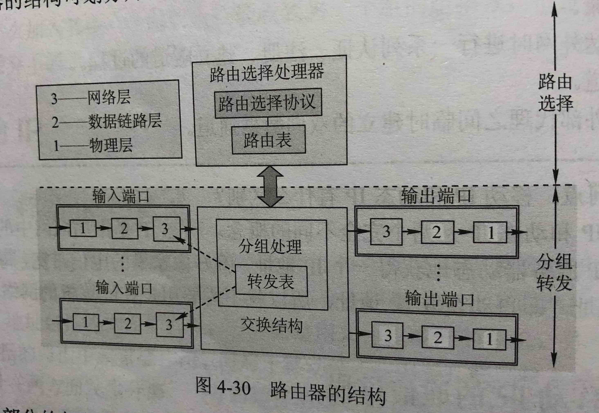

- 路由表与路由转发
  - 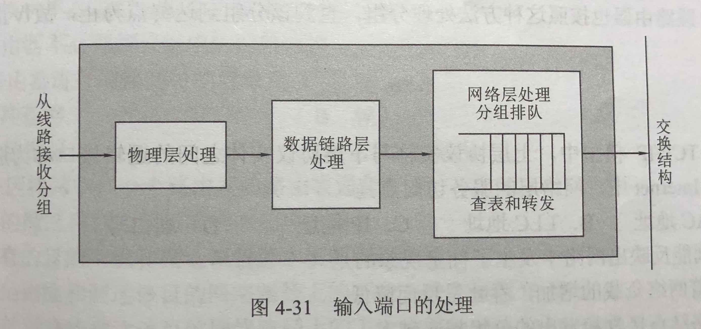
  - 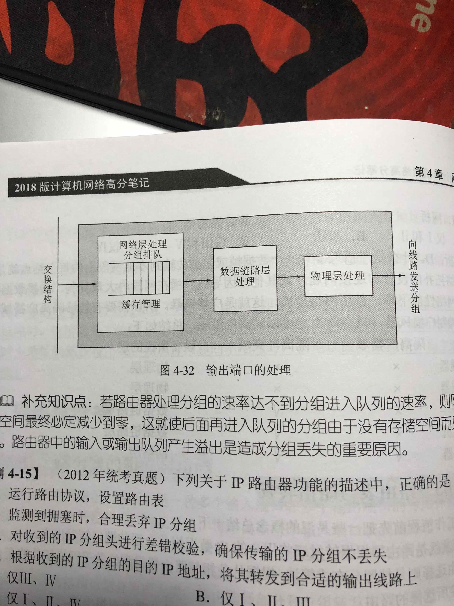

## Reference

- [网络基础之子网划分](http://www.cnblogs.com/linhaifeng/articles/5951486.html)
- [如何计算IP地址及CIDR](https://www.2cto.com/net/201303/192100.html)