# 传输层

应用进程间的逻辑通信 流量控制与可靠传输

- [传输层](#%E4%BC%A0%E8%BE%93%E5%B1%82)
  - [传输层提供的服务](#%E4%BC%A0%E8%BE%93%E5%B1%82%E6%8F%90%E4%BE%9B%E7%9A%84%E6%9C%8D%E5%8A%A1)
  - [UDP](#udp)
  - [TCP](#tcp)
  - [流量控制与可靠传输机制](#%E6%B5%81%E9%87%8F%E6%8E%A7%E5%88%B6%E4%B8%8E%E5%8F%AF%E9%9D%A0%E4%BC%A0%E8%BE%93%E6%9C%BA%E5%88%B6)

- 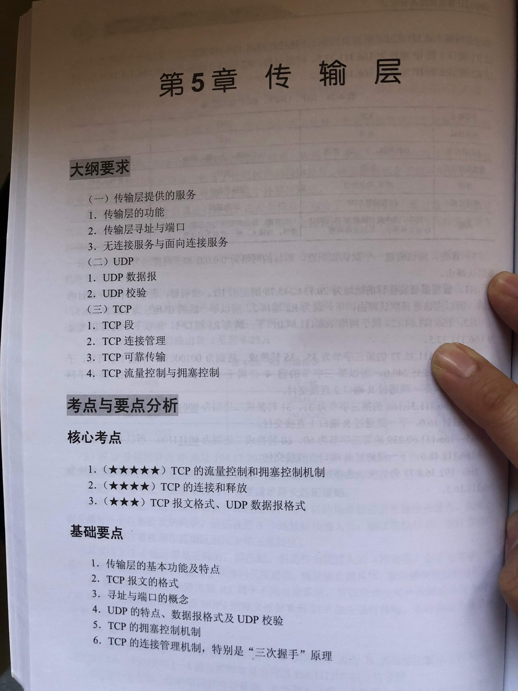
- 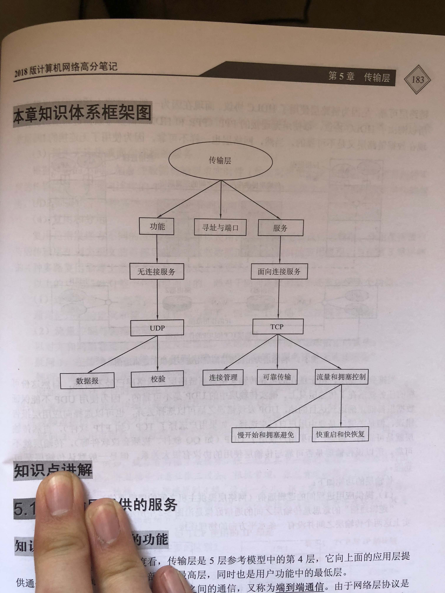

## 传输层提供的服务

- 传输层的功能
  - 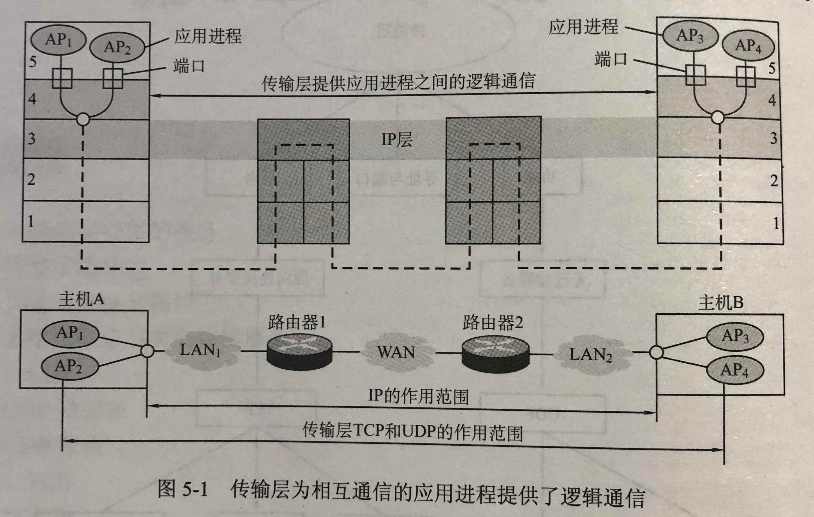
  - 功能
    - 传输层提供应用进程间的逻辑通信，网络层提供主机之间的逻辑通信
    - 差错检测
    - 提供无连接或面向连接的服务，对连接服务：连接管理（握手管理），流量控制与拥塞控制
    - 复用和分用

- 传输层寻址与端口
  - 端口的基本概念：通过（软件）端口把数据报传到各自的应用进程。
  - 端口号：标识不同的进程
  - 套接字：（主机IP地址，端口号），唯一标识网络中某台主机上的应用进程

- 无连接服务与面向连接服务：相应实现 UDP TCP
  - UDP (用户数据报协议) 的主要特点：无需连接，无需确认，不可靠交付，报文头部短，传输开销小，时延较短
  - UDP 数据报与 IP 分组：UDP 数据报是 IP 数据报中的数据部分
  - TCP (传输控制协议) 的主要特点：面向连接，需确认（提供广播多播），可靠交付，报文头部长，传输开销大，时延较长
  - TCP 连接和网络层的虚电路的区别：电路交换是真正建立一条物理连接。虚电路不是一条真正的物理连接。TCP 报文文段是在传输层抽象的端到端逻辑信道中传送的，与路由器无关。

## UDP

- UDP 报文段
  - 基本概念
    - UDP 和 TCP 的最大区别：无连接
    - UDP 其实只在 IP 的数据报服务之上增加了端口的概念和差错检测的功能
  - 数据报组成
    - 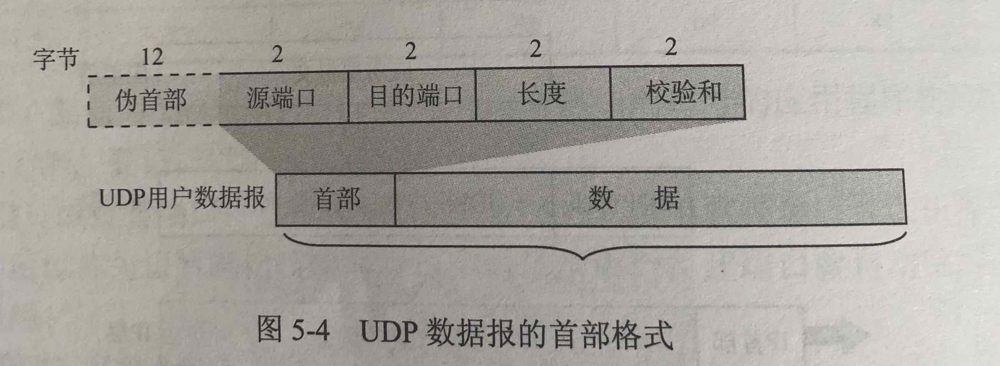

- UDP 校验：当无差错时结果应该为全1
  - 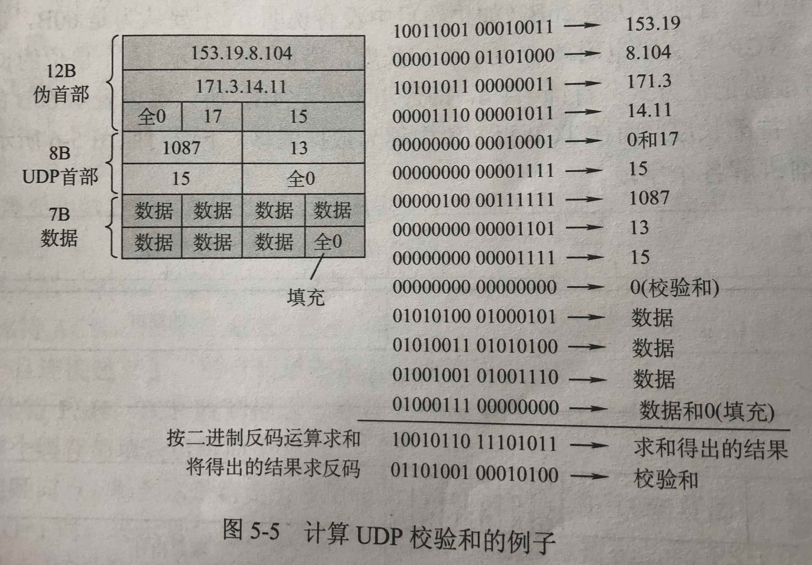

## TCP

- TCP 报文段
  - 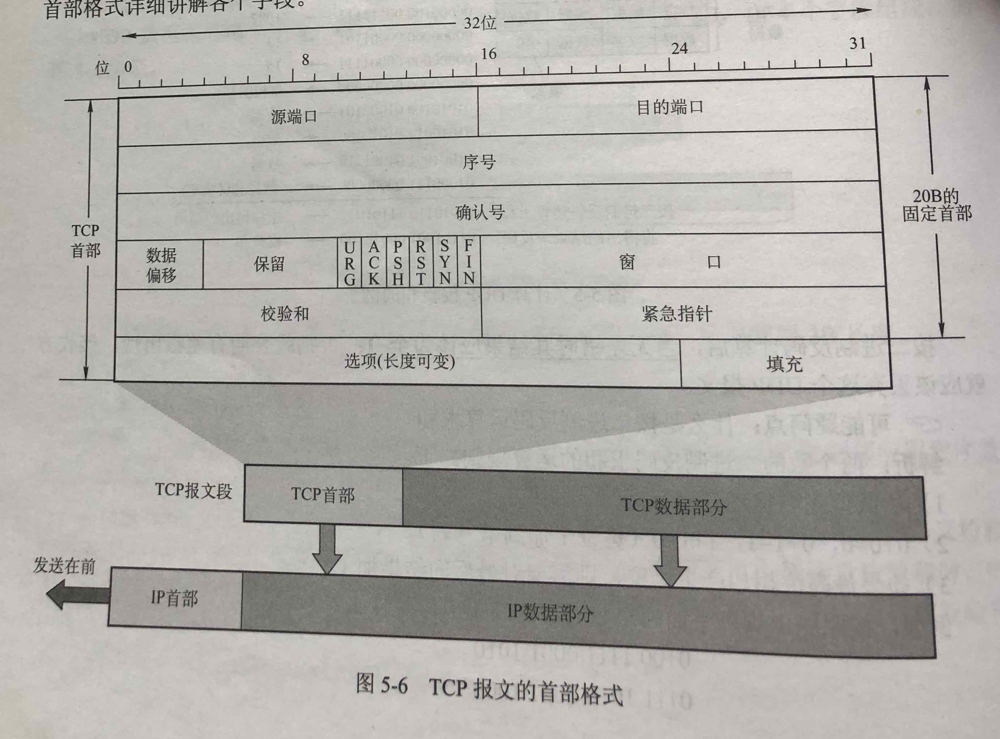

- TCP 连接管理：建立连接，传送数据，释放连接
  - 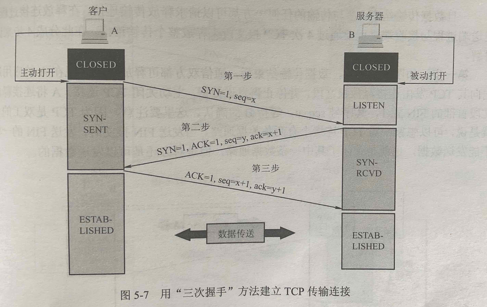
  - 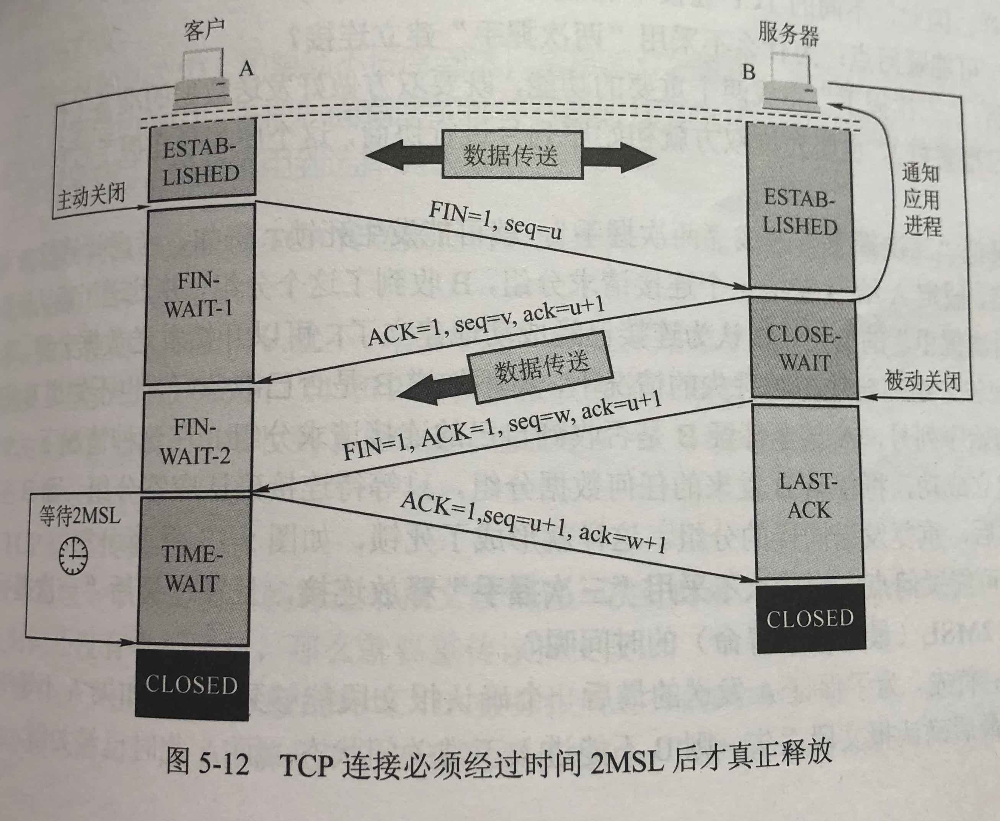

- TCP 可靠传输
  - TCP 数据编号与确认
  - TCP 的重传机制：确认反馈时间超时就要重传

- TCP 流量控制：让发送方的发送速率不要太快，既要让接收方来得及接收，也不要使网络发生拥塞
  - 滑动窗口机制
  - 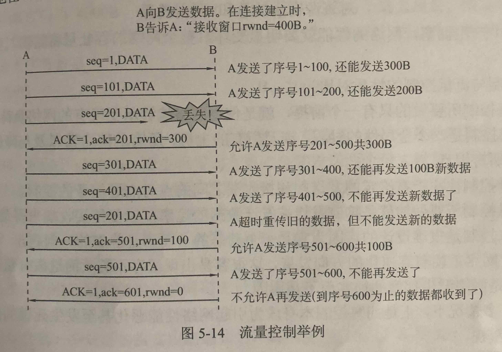

- TCP 拥塞控制的基本概念
  - 产生拥塞的条件：对资源需求的总和 > 可用资源
  - 拥塞控制又分为闭环控制和开环控制
    - 开环控制：在设计网络时事先将有关发生拥塞的因素考虑周到，力求网络在工作时不产生拥塞
    - 闭环控制：基于反馈环路的概念

- 拥塞控制的4种算法
  - 慢开始算法
  - 

  - 拥塞避免算法
  - 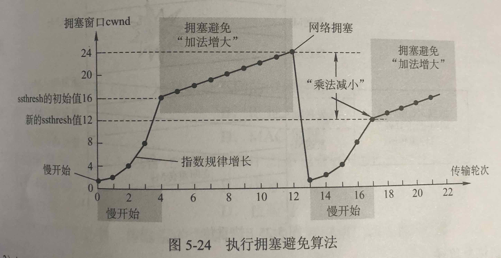

  - 快重传算法
  - 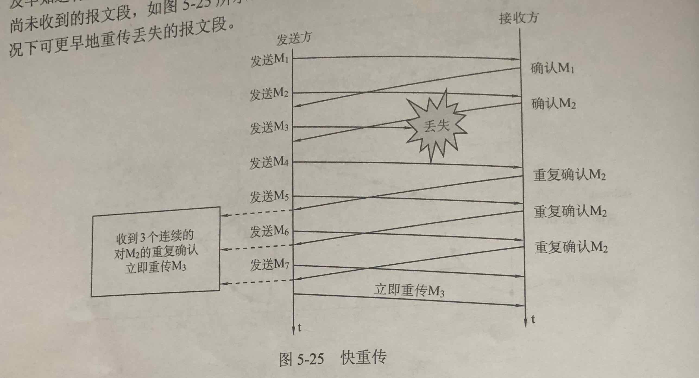

  - 快恢复算法
  - 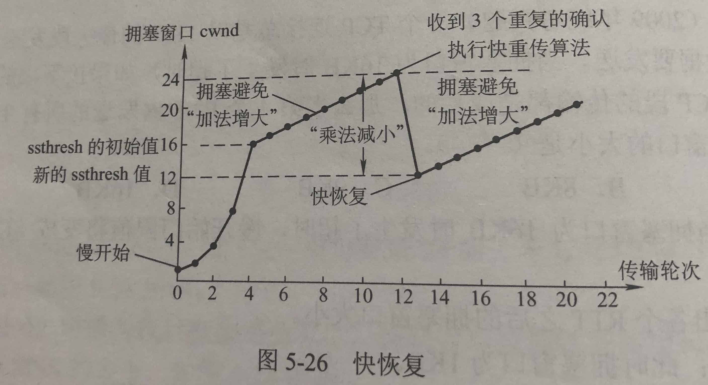

## 流量控制与可靠传输机制

- 流量控制：控制发送方发送数据的速率，使接收方来得及接收，常见两种控制方式
  - 停止-等待流量控制：发送 -> 等待应答 -> 继续发送或一直等待
  - 滑动窗口流量控制：如果发送方收到接受方的窗口大小为0的TCP数据报，那么发送方将停止发送数据，等到接受方发送窗口大小不为0的数据报的到来。

- 可靠传输机制

- 滑动窗口机制

- 停止-等待协议

- 后退N帧(GBN)协议：基于滑动窗口机制，如果某个帧出错了，接收方只能简单地丢弃该帧及其所有的后续帧。

- 选择重传(SR)协议：基于滑动窗口机制，只重传出错帧

- 发送缓存和接收缓存
  - 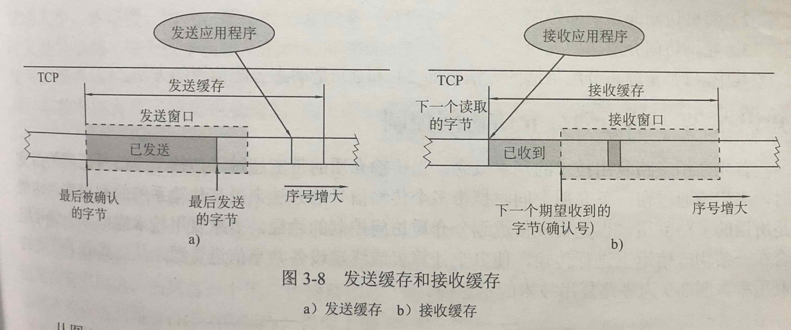