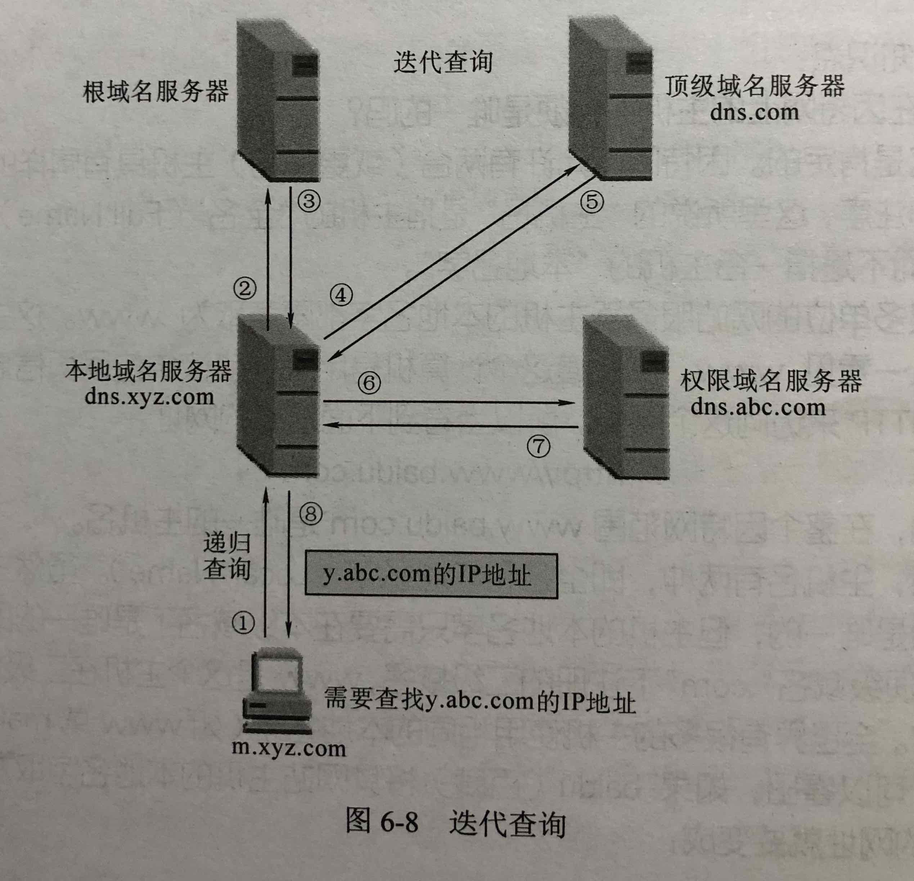
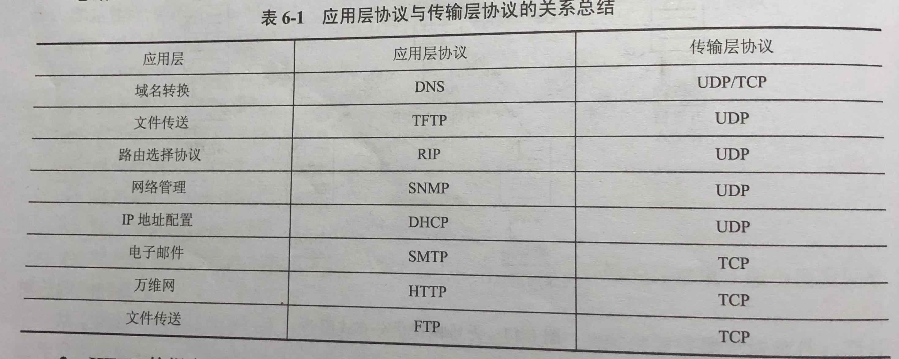

# 应用层

应用之间的通信模式，域名与IP地址，

- [应用层](#%E5%BA%94%E7%94%A8%E5%B1%82)
  - [网络应用模型：应用进程之间相互通信和协作所采取的模式，有两种](#%E7%BD%91%E7%BB%9C%E5%BA%94%E7%94%A8%E6%A8%A1%E5%9E%8B%EF%BC%9A%E5%BA%94%E7%94%A8%E8%BF%9B%E7%A8%8B%E4%B9%8B%E9%97%B4%E7%9B%B8%E4%BA%92%08%E9%80%9A%E4%BF%A1%E5%92%8C%E5%8D%8F%E4%BD%9C%E6%89%80%E9%87%87%E5%8F%96%E7%9A%84%E6%A8%A1%E5%BC%8F%EF%BC%8C%E6%9C%89%E4%B8%A4%E7%A7%8D)
  - [DNS系统](#dns%E7%B3%BB%E7%BB%9F)
  - [FTP](#ftp)
  - [电子邮件](#%E7%94%B5%E5%AD%90%E9%82%AE%E4%BB%B6)
  - [WWW](#www)
  - [应用层协议与传输层协议的关系总结](#%E5%BA%94%E7%94%A8%E5%B1%82%E5%8D%8F%E8%AE%AE%E4%B8%8E%E4%BC%A0%E8%BE%93%E5%B1%82%E5%8D%8F%E8%AE%AE%E7%9A%84%E5%85%B3%E7%B3%BB%E6%80%BB%E7%BB%93)

- 
- 

## 网络应用模型：应用进程之间相互通信和协作所采取的模式，有两种

- 客户/服务器模型（C/S 模型）：进程之间的服务与被服务关系
- P2P 模型：本质上仍然是C/S模型，但每个主机既是服务方又是被服务方。

## DNS系统

- DNS 系统的概念：用域名代替IP地址，方便访问网站
  - 组成：域名空间，域名服务器，解析器

- 层次域名空间
  - 

- 域名服务器
  - 

- 域名解析过程
  - 
  - 

## FTP

- FTP 的工作原理
  - 功能：提供交互式访问，允许客户指明文件的类型与格式，并允许文件具有存取权限
  - FTP 服务器进程包括：一个主进程负责接收新需求，若干从属进程负责处理单个请求。

- 控制连接与数据连接
  - 

## 电子邮件

- 电子邮件的组成结构: 用户代理，邮件服务器，使用协议
  - 

- 电子邮件格式与 MIME
  - 

- SMTP 与 POP3
  - SMTP: Simple Mail Tranfer Protocal 邮件传送协议
  - POP3: Post Office Protocal-Version 3 邮件读取协议

## WWW

- WWW 的概念和组成结构
  - World Wide Web 万维网：大规模 联机 信息储藏所
  - 超媒体：有文本、图片、声音、动画、链接的页面
  - 超文本：有文本和链接的页面
  - 超链接：页面的链接
  - 统一资源定位符 URL: 标志WWW上的各种文档，格式：<协议>://<主机>:<端口号>/<路径>
  - 浏览器：万维网客户程序

- HTTP：超文本传输协议，客户程序（浏览器）与WWW服务器程序之间进行交互所使用的协议
  - 操作过程
  - 报文结构
    - 

## 应用层协议与传输层协议的关系总结

- 