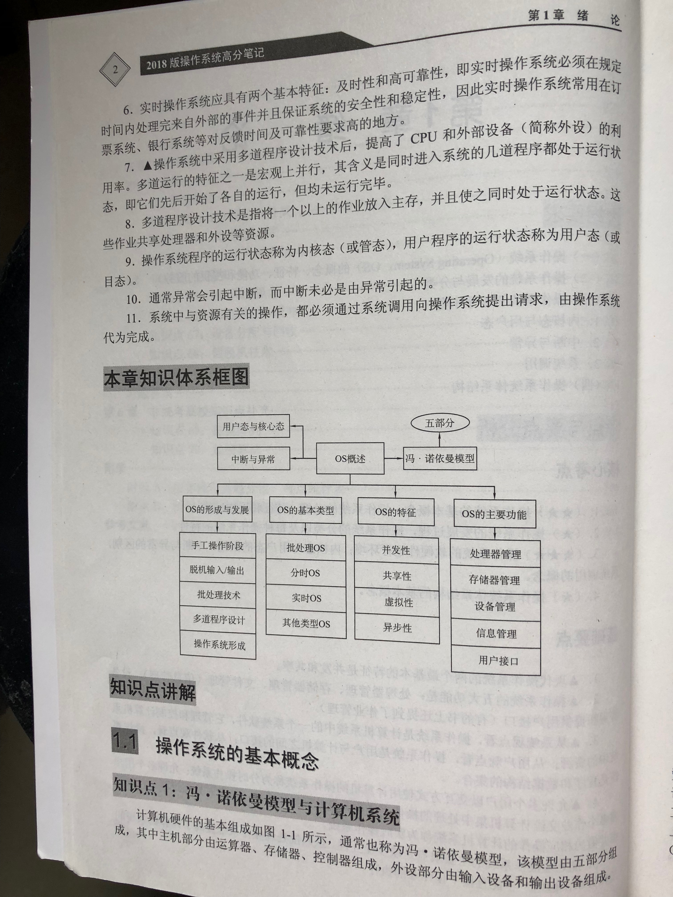
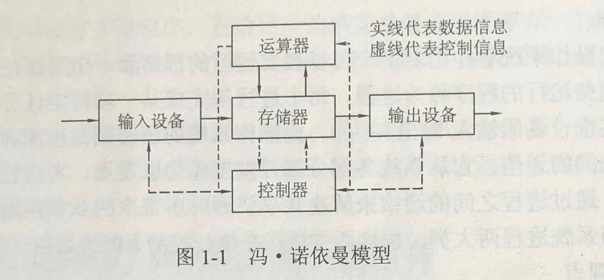
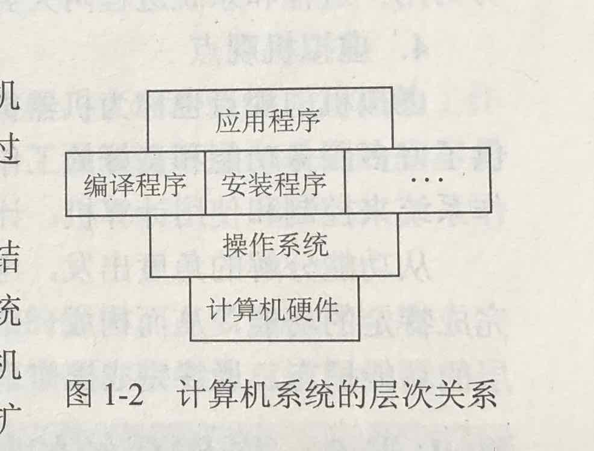
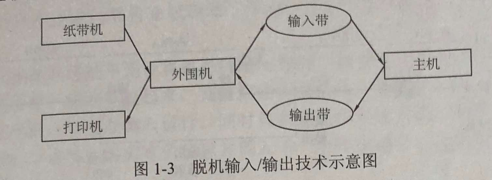
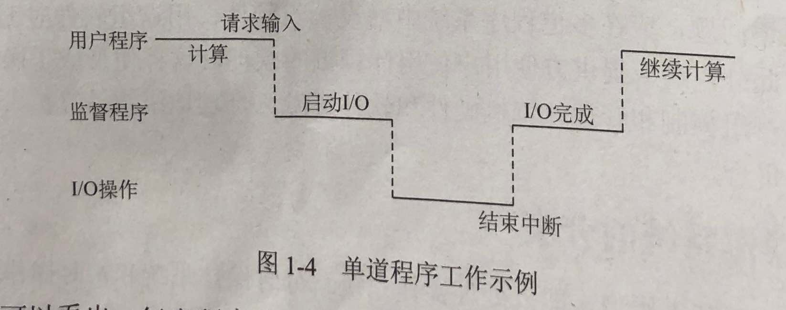
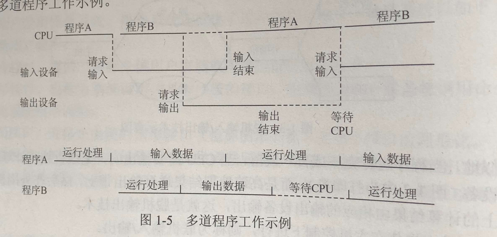

# 操作系统学习笔记：绪论

操作系统的概念、特征、发展、分类、运行环境、体系结构

- [操作系统学习笔记：绪论](#%E6%93%8D%E4%BD%9C%E7%B3%BB%E7%BB%9F%E5%AD%A6%E4%B9%A0%E7%AC%94%E8%AE%B0%EF%BC%9A%E7%BB%AA%E8%AE%BA)
  - [操作系统的基本概念](#%E6%93%8D%E4%BD%9C%E7%B3%BB%E7%BB%9F%E7%9A%84%E5%9F%BA%E6%9C%AC%E6%A6%82%E5%BF%B5)
  - [操作系统的发展和分类](#%E6%93%8D%E4%BD%9C%E7%B3%BB%E7%BB%9F%E7%9A%84%E5%8F%91%E5%B1%95%E5%92%8C%E5%88%86%E7%B1%BB)
  - [操作系统的运行环境](#%E6%93%8D%E4%BD%9C%E7%B3%BB%E7%BB%9F%E7%9A%84%E8%BF%90%E8%A1%8C%E7%8E%AF%E5%A2%83)
  - [操作系统的体系结构](#%E6%93%8D%E4%BD%9C%E7%B3%BB%E7%BB%9F%E7%9A%84%E4%BD%93%E7%B3%BB%E7%BB%93%E6%9E%84)
  - [Reference](#reference)

- 
- 

## 操作系统的基本概念

- 冯诺伊曼模型与计算机系统
  - 
  - 

- 操作系统的概念
  - 用户观点：使用
  - 系统观点（资源管理观点）：管理资源
  - 进程观点：控制协调各应用进程
  - 虚拟机观点：机器扩充

- 操作系统的特征：并发性，共享性，虚拟性，异步性

- 操作系统的主要功能和提供的服务：处理器管理，存储器管理，设备管理，文件管理

## 操作系统的发展和分类

- 操作系统的形成与发展
  - 手工操作阶段
  - 脱机输入输出阶段：为输入输出建立缓冲
    - 
  - 批处理技术：对一批作业自动进行处理
  - 多道程序设计技术
    - 
    - 
  - 操作系统的形成

- 操作系统的分类
  1. 批处理操作系统：单道 多道
  2. 分时操作系统：时间分片，轮流处理
  3. 实时操作系统：实施响应
  4. 嵌入式操作系统：嵌入电器、手机
  5. 集群系统：多台计算机共同完成一个任务
  6. 网络操纵系统：多台计算机互操作互协作
  7. 分布式操作系统：多台计算机像一个计算机一样

## 操作系统的运行环境

- 处理器的执行状态：内核态，用户态
  - 内核态（管态，系统态）：操作系统管理程序执行时
  - 用户态（目态）：用户程序执行时

- 中断与异常：通常异常会引起中断，而中断未必是由异常引起的

- 系统调用：系统调用把应用程序的请求传给内核，调用相应的内核函数完成所需的处理，并将处理结果返回给应用程序。

## 操作系统的体系结构

- 模块组合结构：分为若干块
  - 优点：结构紧密，接口简单，效率高
  - 缺点：独立性难度大，复杂

- 层次结构：分为若干层
  - 优点：关系清晰，高扩展
  - 缺点：分层难度，复杂

- 微内核结构：将次要服务从内核中分离出去
  - 优点：可靠，灵活，便于维护
  - 缺点：效率低

## Reference

- [操作系统学习笔记-00概览](http://blog.talisk.cn/blog/2015/09/26/OS-Learning-01-Overview/)