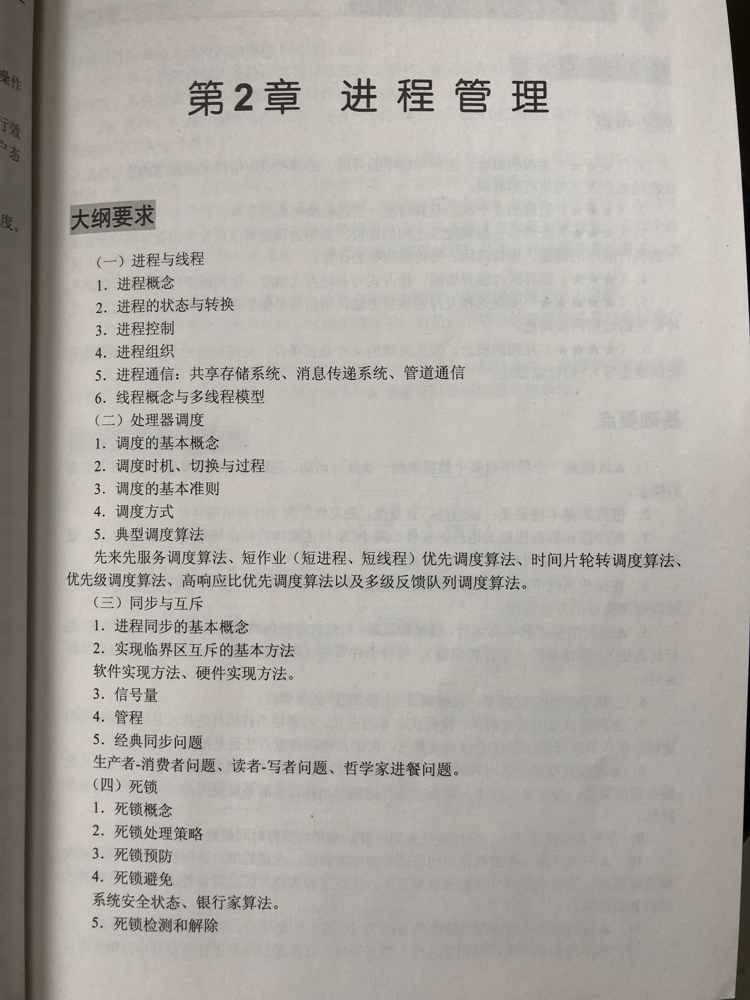
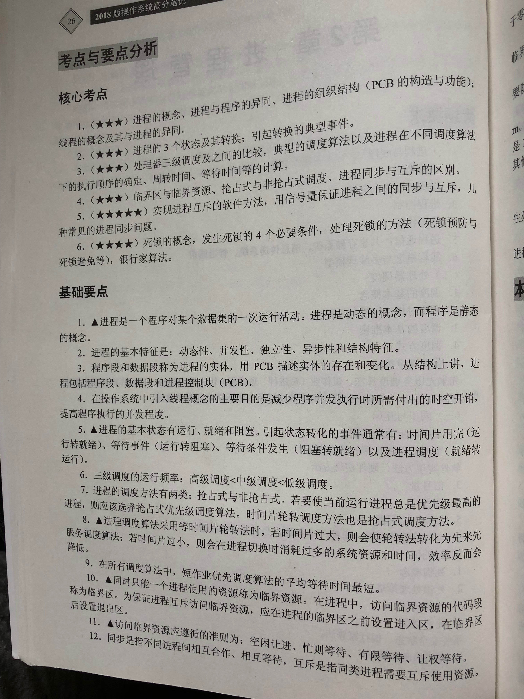
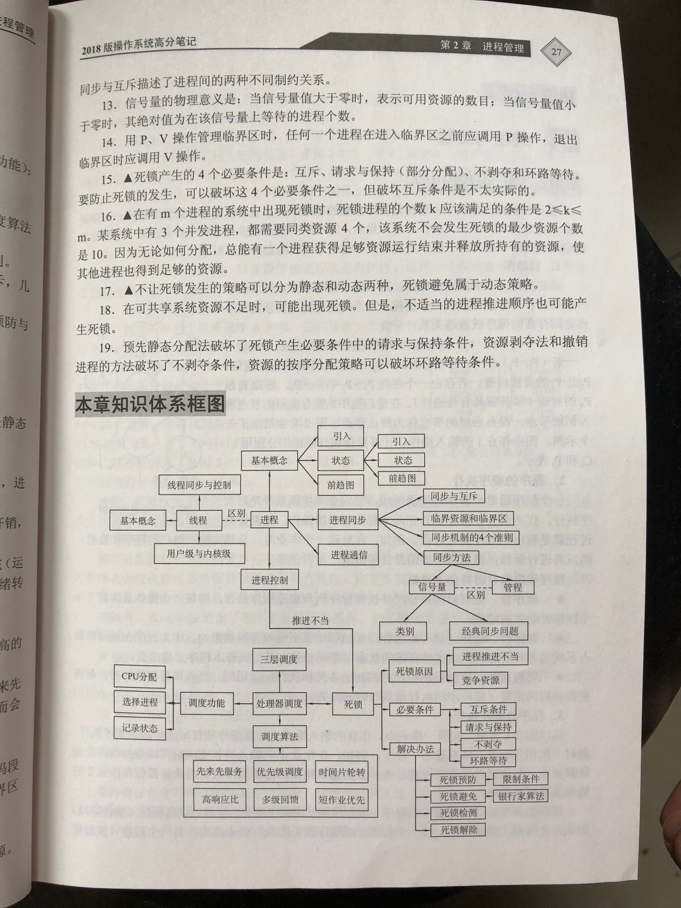
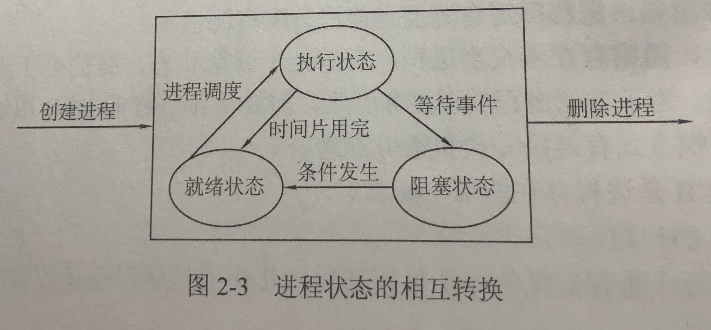

# 进程管理

程序与进程，进程与线程，CPU调度进程，进程同步，进程互斥，进程死锁

- [进程管理](#%E8%BF%9B%E7%A8%8B%E7%AE%A1%E7%90%86)
  - [进程与线程](#%E8%BF%9B%E7%A8%8B%E4%B8%8E%E7%BA%BF%E7%A8%8B)
  - [处理器调度](#%E5%A4%84%E7%90%86%E5%99%A8%E8%B0%83%E5%BA%A6)
  - [同步与互斥](#%E5%90%8C%E6%AD%A5%E4%B8%8E%E4%BA%92%E6%96%A5)
  - [死锁](#%E6%AD%BB%E9%94%81)
  - [Reference](#reference)

- 
- 
- 

## 进程与线程

- 进程的引入：资源分配的基本单位，独立运行的基本单位（线程不是）

  - 前驱图：有向无循环图
  - 程序的顺序执行：顺序性，封闭性，可再现性
  - 程序的并发执行：间断性（和其他程序相互制约），失去封闭性（因共享资源而受到其他程序执行的影响），不可再现性
  - 程序并发执行的条件：Bernstein 条件：两个读操作之间存储器不发生变化，写操作的结果不会丢失

- 进程的定义及描述：程序这种静态概念已经不能如实反映程序活动的特征，所以引入进程概念

  - 进程的定义：1 程序在某个数据集合上的一次运行过程；2 程序在处理器上的一次执行过程。
  - 进程的特征：动态性（是执行过程，有生命周期），并发性（可以并发执行），独立性（是独立实体），异步性（各执行各的），结构特征（进程有自己的组成）
  - 进程和程序的关系：进程包含程序；一个程序可以产生多个进程；一个进程可以执行多个程序。
  - 进程和作业的区别：一个作业由一个或多个进程实现，但一个进程不能构成多个作业。
  - 进程的组成：包括程序段、数据段和一个进程控制块（Process Control Block）。PCB是进程存在的唯一标志。

- 进程的状态与转换

  - 进程的三种基本状态：就绪，执行（运行），阻塞（等待）
  - 进程状态的相互转换：处于运行态的进程个数不能大于处理器个数，处于就绪态和等待态的进程可有多个。通常情况下，进程被创建后处于就绪态。
    - 

- 进程的控制：对进程的控制和管理均由原语实现

  - 基本概念：操作系统的内核（常驻内存的公用或运行频率较高的模块），原语（由若干条机器指令构成的一段程序，在执行期间不可分割）
  - 进程的创建：申请PCB 指定PID -> 分配资源 -> PCB初始化 -> 插入就绪队列
  - 进程的撤销：找到PCB -> 停止执行 -> 回收PCB
  - 进程的阻塞：停止运行 -> 保存现场 -> 停止进程
  - 进程的唤醒：移出等待队列 -> 插入就绪队列

- 线程

  - 线程的作用：减少进程并发执行时所付出的操作系统的开销，使操作系统具有更好的并发性
  - 线程的引入：将进程的两个基本属性分开（拥有资源的独立单元，独立调度和分配的单元），后者由线程实现。
  - 线程的定义：进程内一个相对独立的、可调度的执行单元；多线程是指一个进程中有多个线程。
  - 线程的实现：由操作系统内核实现线程（当一个线程阻塞时，其他线程不受影响）；由应用进程实现线程（当一个线程阻塞时，其进程必须等待）
  - 线程与进程的比较：调度（线程切换，进程不切换），拥有资源（线程无，进程有），并发性（线程可，进程可），系统开销（线程小，进程大）
  - 多线程模型：多对一（多个用户级线程映射到一个内核级线程），一对一（一个用户级线程映射到一个内核级线程），多对多（多个用户级线程映射到多个内核级线程）

- 进程通信：进程之间的信息交换
  - 低级方式：互斥，同步
  - 高级方式：共享存储器系统（共享存储区），消息传递系统（利用系统通信命令），管道通信系统（用共享文件）

## 处理器调度

- 处理器的三级调度：如何高效利用CPU

  - 高级调度（作业调度）：从后备作业中选择一个或多个，给它们分配资源，几分钟一次。
  - 中级调度：在换页时将页面在外存与内存之间调度
  - 低级调度（进程调度）：从就绪队列中选取一个进程，将处理器分配给它，几十毫秒一次。

- 调度的基本原则：CPU利用率（尽可能高），吞吐率（尽可能高），响应时间（尽量短），周转时间（尽量短）

- 进程调度

  - 进程调度的功能：记录所有进程状态，选择进程，分配处理器
  - 引起进程调度的原因：运行结束，进入阻塞状态，调度新进程，新进程就绪，时间片用完
  - 进程调度的方式：抢占方式（剥夺旧进程），非抢占方式（等待旧进程结束）

- 常见调度算法

  1. FCFS（First Come First Served）先来先服务调度算法（作业调度 进程调度）：按照进程（或作业）进入就绪队列的先后次序来分配处理器
  2. SJF（Shortest Job First）短作业优先调度算法（作业调度 进程调度）：把处理器分配给最快完成的进程（或作业）
  3. 优先级调度算法（作业调度 进程调度）：把处理器分配给优先级最高的进程（或作业）
  4. RR（Round-Robin）时间片轮转调度算法（进程调度）：把所有就绪进程排成队列，每个执行完规定时间（时间片）时送至对位，不断循环。
  5. 多级队列调度算法（进程调度）：将就绪进程分属不同的队列，每个队列采用各自的调度算法。
  6. 多级反馈队列调度算法（进程调度）：将就绪进程分属不同的队列，每个队列赋予不同优先级、不同时间片。

## 同步与互斥

- 进程同步的基本概念

  - 两种形式的制约关系：间接相互制约关系 - 互斥（同类进程即为互斥关系），直接相互制约关系 - 同步（不同类进程即为同步）
  - 临界资源与临界区：临界资源：同时仅允许一个进程使用的资源；临界区（临界段）：进程中用于访问临界资源的代码
  - 互斥的概念与要求：禁止两个进程同时进入临界区的准则：空闲让进，忙则等待，有限等待，让权等待
  - 同步的概念与实现机制：进程间在关键点上需要互相等待或互相交换信息。用信号量实现进程同步。

- 互斥实现方法：软件方法（算法困难、复杂），硬件方法（中断屏蔽，硬件指令）

- 信号量：在多个相互合作的进程之间使用简单的信号来同步

  - 信号量：信号量是一个确定的二元组(s,q)，s是非负初值的整型变量，q是一个初始状态为空的队列

  - 同步原语：P 操作（wait 操作），V 操作（signal 操作）P V 操作的原语描述如下：
    ```c
    P(s)：将信号量自减1，若小于0，则该进程阻塞，排入与信号量s有关的进程队列中，若结果大于等于0，则继续执行。
    V(s)：将信号量自加1，若结果小于或等于0，则从队列中释放一个进程，并转为就绪态，若结果大于0，则继续执行该进程。

    记录型信号量和PV操作定义如下：

    typedef struct semaphore {
        int value;
        struct pcb *list;
    }
    void P(semaphore s) {
        s.value--;
        if(s.value<0) sleep(s.list);
    }
    void V(semaphore s) {
        s.value++;
        if(s.value<=0) wakeup(s.list);
    }

    由此我们可以得出三个推论：
    s.value为正数时，正是实际可用物理资源数
    s.value为负数时，其绝对值为登记排列在s信号量队列中等待的进程个数
    P操作意味着请求一个资源，V操作意味着释放一个资源，在一定条件下，P操作代表挂起进程操作，V操作代表唤醒被挂起进程的操作。
    ```

  - 信号量的分类：整形信号量、记录型信号量
    - 整形信号量N只是一个整型值，代表着某类资源的数目，当N<=0，即后申请使用该资源的进程会不断地查询是否N>0，一旦N>0，即取之来用，这是一种忙等现象；
    - 记录型信号量S是一个结构体，S.value相当于整形信号量N，当S.value<=0，即后申请使用该资源的进程会进入阻塞状态，并将其挂在S.L中，等待唤醒，遵循“让权等待”策略；

  - 信号量的应用
    - 实现进程同步
    ```c
    semaphore N = 0; // 设置信号量并设置初值为0
    P1(){ S1; V(N); }
    P2(){ P(N); S2; }
    ```
    - 实现进程互斥
    ```c
    semaphore N = 1; // 设置信号量并设置初值为1
    P1(){ P(N); P1的临界区代码; V(N); }
    P2(){ P(N); P2的临界区代码; V(N); }
    ```

- **经典同步问题**

  - 生产者消费者问题
    ```c
    semaphore empty = k, full = 0;  // 初始状态，缓冲区为空，容量为k
    semaphore mutex = 1;   // 互斥信号量
    process Producer() {
        while(true) {
        produce();   // 生产操作
        P(empty);    // 申请一个空缓冲区
        P(mutex);    // 申请使用缓冲池
        store();     // 将产品放入缓冲区
        V(mutex);    // 缓冲池使用完毕，释放互斥信号量
        V(full);     // 增加一个满缓冲区
        }
    }
    process Consumer() {
        while(true) {
            P(full);    // 申请一个满缓冲区
            P(mutex);   // 申请使用缓冲池
            pickup();   // 取出产品
            V(mutex);   // 缓冲池使用完毕，释放互斥信号量
            V(empty);   // 增加一个空缓冲区
            comsume();  // 消费掉产品
        }
    }
    ```

  - 读者-写者问题
  - 哲学家进餐问题
  - 理发师问题

- 关于 P V 问题的解题思路

- 管程: 定义了一个数据结构和能为并发进程所执行的一组操作，这组操作能同步进程和改变管程中的数据。

## 死锁

- 死锁的概念

  - 定义：如果一个进程集合中的每个进程都在等待中只能由此集合中的其他进程才能引发的事件，而无限期陷入僵持的局面称为死锁。
  - 参与死锁的进程中至少有两个进程占有资源，每个参与死锁的进程均等待资源。

- 死锁产生的原因和必要条件

  - 资源分类：可剥夺资源，不可剥夺资源
  - 死锁产生的原因：竞争资源、进程间推进顺序非法
  - 死锁产生的必要条件：互斥条件、请求和保持条件、不剥削条件、环路等待条件

- 处理死锁的基本方法：预防死锁（执行前预防）、避免死锁（执行时避免）、检测和解除死锁（执行后检测和解除）

- 死锁的预防：互斥条件、请求和保持条件、不剥削条件、环路等待条件

  - 互斥条件（mutual exclusion）：临界资源是独占资源，进程应互斥且排他地使用这些资源。
  - 占有和等待条件（hold and wait）：进程在请求资源得不到满足而等待时，不释放已有资源。
  - 不剥夺条件（no preemption）：又称不可抢占，已获资源只能由进程自愿释放，不允许被其他进程剥夺。
  - 循环等待条件（circular wait）：又称环路条件，存在循环等待链，其中每个进程都在等待链中等待下一个进程所持有的资源，造成这组进程处于永远等待的状态。
  - 前三个条件是必要不充分条件，第四个条件是前三个条件同时存在所产生的结果，条件并不完全独立。但单独考虑每个条件是有用的，只要能破坏四个必要条件之一，就可以防止死锁。

- 死锁的避免

  - 安全状态与不安全状态：安全状态：系统能为每个进程分配所需资源。

  - 银行家**算法**（资源分配拒绝法）：把钱看作资源，客户看作进程，银行家看作操作系统。在客户需要贷款的时候要提出最大需求量，银行家若能满足则要满足，在满足了需求并且使用完毕后，客户要还钱。如果当前银行资金不能满足客户需求，则等到银行有钱再给。
    - 基本思想：系统中所有进程进入进程集合，在安全状态下系统收到进程资源请求后，如果资源够则分配给他，然后系统把剩下的可用资源和进程集合中其他进程还需要的资源数做对比，找出生于资源能满足最大需求量的进程，从而保证进程运行完毕并归还全部资源，这是把这个进程从进程集合中删除，归还其所占用的所有资源，系统的声誉资源则更多，反复执行以上步骤，最后检查进程集合，若为空则表明本次申请可行，系统处于安全状态，可以真正实施本次分配，否则只要进程集合非空，系统便处于不安全状态，本次资源分配暂不实施，让申请资源的进程等待。

- 死锁的检测和解除

  - 死锁检测：通过以下步骤来执行一个死锁检测：
    1. 如果进程－资源分配图中无环路，则无死锁。
    2. 如果进程－资源分配图中有环路，并且每种资源仅有一个资源，则死锁。此时环路是发生死锁的充要条件，环路中的进程就是死锁进程。
    3. 如果进程－资源分配图中有环路，且所涉及的资源均有多个资源，则环路的存在只是产生死锁的必要条件而不是充分条件，系统不一定发生死锁。
    4. 系统发生死锁状态的充分条件是：当且仅当此状态进程－资源分配图是不可完全简化的，这一充分条件称为死锁定理。
    5. 
  - 死锁检测**算法**
  - 死锁解除: 剥夺资源，撤销进程

- 死锁与饿死：进程饥饿，进程饿死

## Reference

- [操作系统学习笔记-01处理器管理](http://blog.talisk.cn/blog/2015/10/11/OS-Learning-02-CPU-Scheduling/)
- [计算机操作系统---处理机(进程)管理](http://blog.csdn.net/xiang__jiangsu/article/details/47056929)