# 操作系统学习笔记 - 内存管理

对内存的分配、回收、保护、扩充，地址转换

- [操作系统学习笔记 - 内存管理](#%E6%93%8D%E4%BD%9C%E7%B3%BB%E7%BB%9F%E5%AD%A6%E4%B9%A0%E7%AC%94%E8%AE%B0---%E5%86%85%E5%AD%98%E7%AE%A1%E7%90%86)
  - [内存管理基础](#%E5%86%85%E5%AD%98%E7%AE%A1%E7%90%86%E5%9F%BA%E7%A1%80)
  - [虚拟内存管理](#%E8%99%9A%E6%8B%9F%E5%86%85%E5%AD%98%E7%AE%A1%E7%90%86)
  - [内存管理方式之间的对比与一些计算方法](#%E5%86%85%E5%AD%98%E7%AE%A1%E7%90%86%E6%96%B9%E5%BC%8F%E4%B9%8B%E9%97%B4%E7%9A%84%E5%AF%B9%E6%AF%94%E4%B8%8E%E4%B8%80%E4%BA%9B%E8%AE%A1%E7%AE%97%E6%96%B9%E6%B3%95)
  - [Reference](#reference)

- 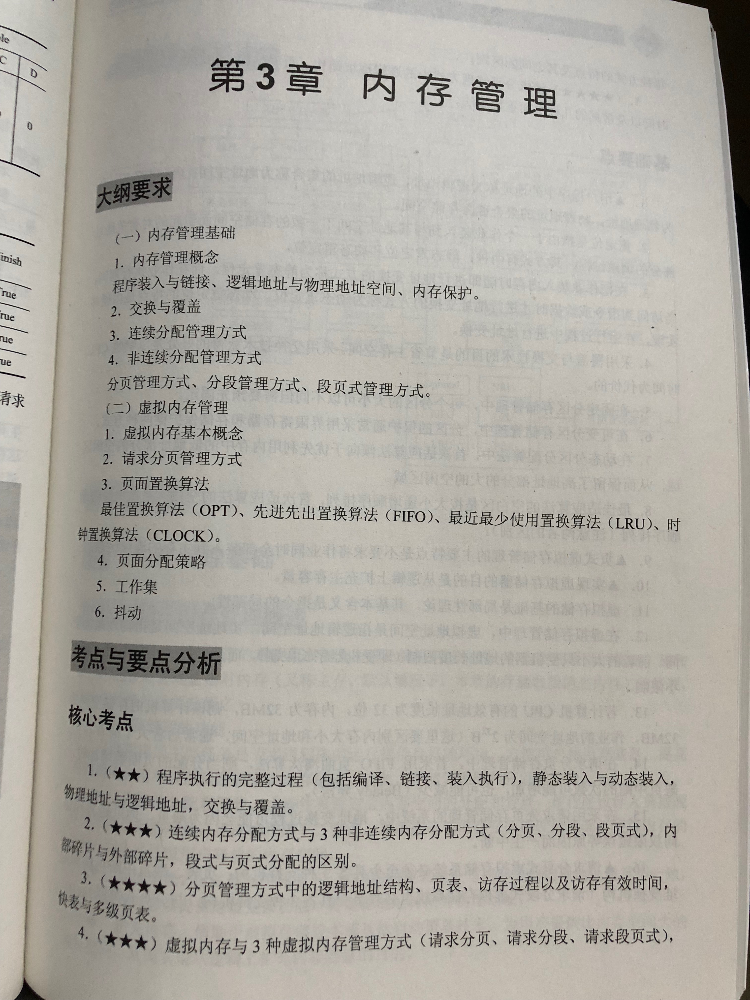
- 
- 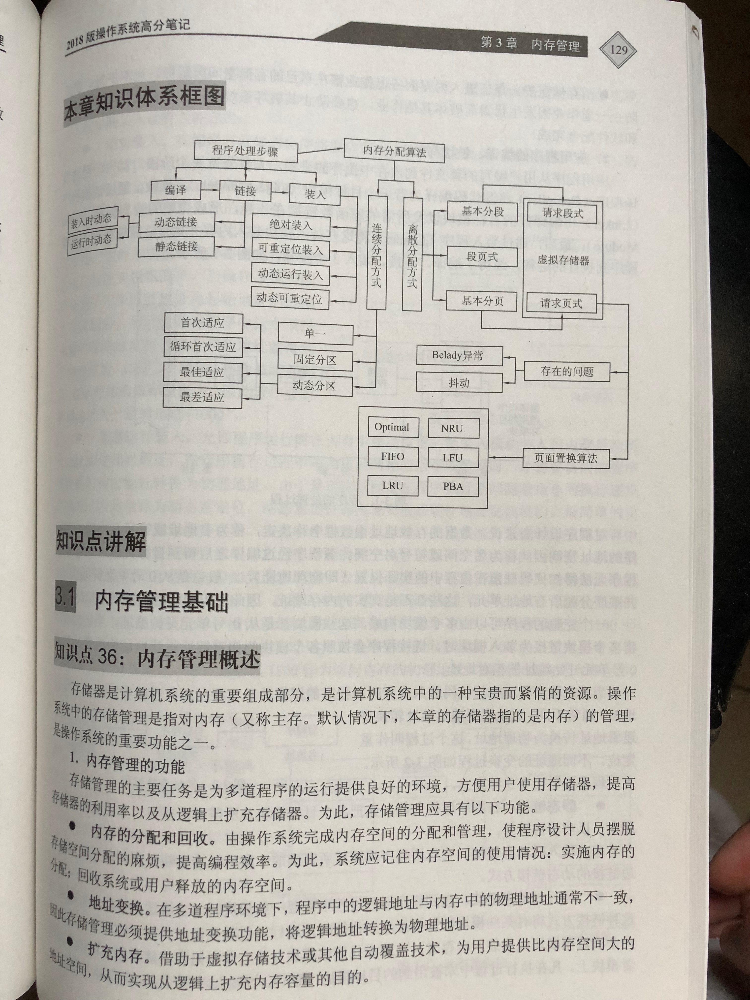

## 内存管理基础

- 内存管理概述

  - 内存管理的功能：内存的分配和回收，地址变换，扩充内存，存储保护
  - 应用程序的编译、链接与装入
    - 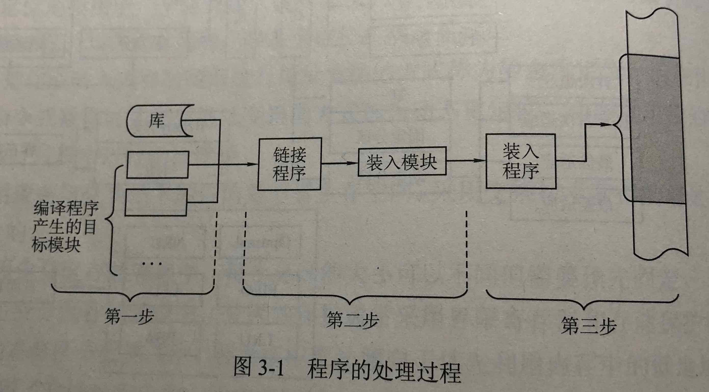
    - 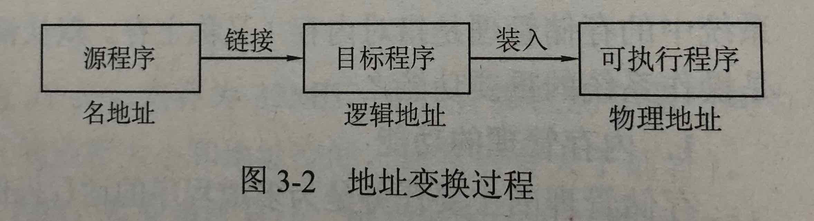
    - 程序的链接有三种方式：静态链接（装入之前链接），装入时动态链接（装入时链接），运行时动态链接（装入后执行时需要哪个再链接哪个）
    - 程序的装入有三种方式：绝对装入（编译时物理地址写入），可重定位装入（静态重定位）（装入时地址变换一次完成），动态运行装入（运行程序时需要哪个再装入哪个）
  - 逻辑地址和物理地址: 源代码经过编译后，目标程序中所用的地址就是逻辑地址，经过地址重定位转换成物理地址，而后装入到内存（物质地址所指定的地方）。
  - 内存保护
    - 界限寄存器方法：上下界寄存器方法（存放作业的开始地址和结束地址，超出则中断），基址和限长寄存器方法（存放作业的开始地址和空间长度，超出则中断）
    - 存储保护键方法：每个存储块分配一个单独的保护键，每个作业也被分配一个单独的保护键，运行时检查是否匹配。

- 交换与覆盖

  - 覆盖(Overlay)技术：大作业与小内存的矛盾，一个大程序分成一系列相对独立的程序单位，顺序覆盖使用内存。工作于一个作业中。
  - 交换(Swapping)技术：外存与内存之间做交换，工作于进程或作业之间。

- 连续分配管理方式

  - 单一连续分配：作为一个内存整体分区。程序通常采用静态重定位方式装入内存。会产生内部碎片。
  - 固定分区分配：分区的大小可以不等，但事先必须确定，在运行时不能改变。程序通常采用静态重定位方式装入内存。
  - 动态分区分配（可变式分区分配）：当作业进入主存时，根据作业的需要动态地建立分区。
    - 分区分配中的数据结构：分配区表，链表
    - 分区分配算法：
      - 最先适应（first fit）分配算法：顺序查找未分配区表或链表，直至找到第一个满足长度要求的空闲区，然后分割空间。
      - 下次适应（next fit）分配算法：总是从未分配区的上次扫描结束处顺序查找未分配区表和链表，直至找到第一个满足长度的空闲区，分割空间。
      - 最优适应（best fit）分配算法：扫描整个未分配区表或链表，从空闲区中挑选一个能满足用户进程要求的最小分区进行分配。通常空闲区按长度递增排列，查找总从最小的开始。
      - 最坏适应（worst fit）分配算法：扫描整个未分配区表或链表，总挑选一个最大的空闲区分割给作业使用，优点是使剩下的空闲区不过小。
      - 快速适应（quick fit）分配算法：专为经常用到的长度的空闲区设立单独的空闲区链表。
    - 分区的回收：与相邻空闲分区合并
    - 分区分配的动态管理：拼接技术（多个分散小分区合并成大分区），动态重定位分区分配技术（动态分区分配+拼接）
    - 动态分区分配的优缺点：优点（共用，开销少，简单），缺点（外部碎片，无法共享，无法扩充）
  - 内部碎片与外部碎片：未被利用的小块存储空间。内部碎片（固定分区中的碎片），外部碎片（非固定分区中的碎片）。

- 非连续分配管理方式

  - 基本分页存储管理方式：将一个作业存放到多个不相邻接的分区中
    1. 分页管理：将作业的任意一页（作业被划分成若干相等的部分）放到主存的任意一块（主存被划分成若干相等的部分）中
    2. 页表：每个页面与每个物理块的映射关系表
    3. 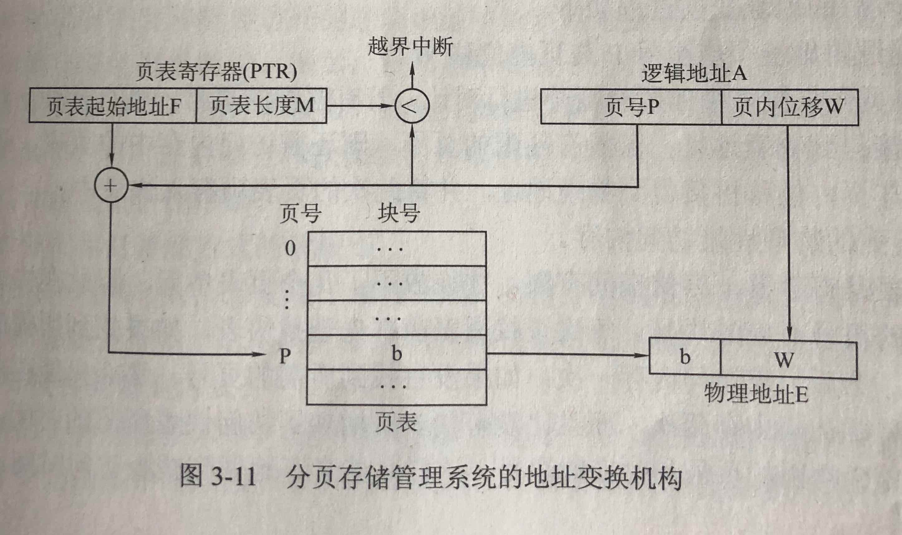
    4. 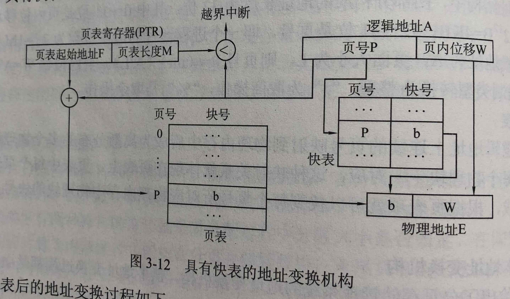 快表（联想存储器）：具有并行查找功能的高度缓冲存储器
    5. 两级页表和多级页表：两级页面（将逻辑地址划分为外层页号、外层页内地址和页内地址），多级页面（增加级数）
    6. 页的共享与保护：共享的含义：使实现用户地址空间中的页指向相同的物理块；保护的方式：地址越界保护，访问控制保护。
    7. 基本分页存储管理方式的优缺点：优点（利用率高，离散分配，便于控制，无外部碎片），缺点（需硬件支持，效率低，共享难，有内部碎片）

  - 基本分段存储管理方式
    1. 分段存储原理：进程的逻辑地址空间分成多段，分为段号和段内位移。基于可变分区存储管理原理，以段位单位来划分和连续存放，为作业的各段分配一个连续内存空间，各段之间不一定连续。分配空间时先建立段表，各段在内存中的情况可由段表来记录。
    2. 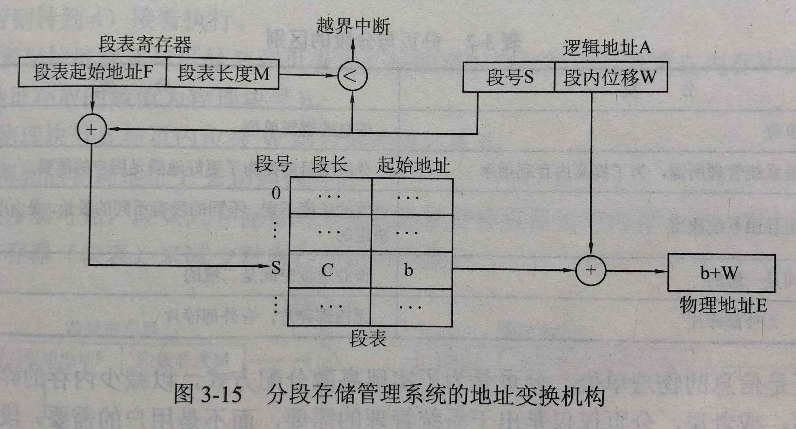
    3. 段的共享与保护：共享原理：都指向被共享段的同一个物理副本来实现的；保护的方式：地址越界保护，访问控制保护。
    4. 基本分段存储管理方式的优缺点：优点（便于处理变化的程序和数据，便于动态链接和共享，无内部碎片），缺点（需硬件支持，需采用拼接技术，受主存限制，有外部碎片）
    5. 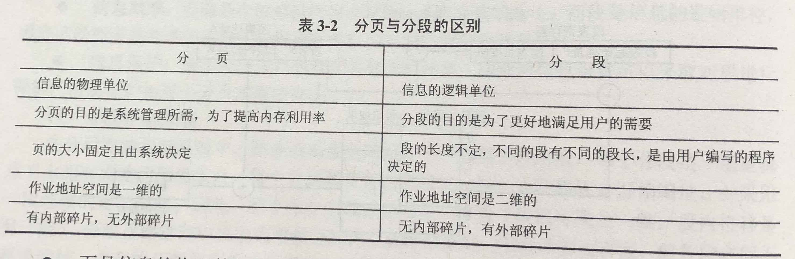

  - 基本段页式存储管理方式：段页式结合了段式和页式的优点，但是其内部碎片比页式的多。
    - 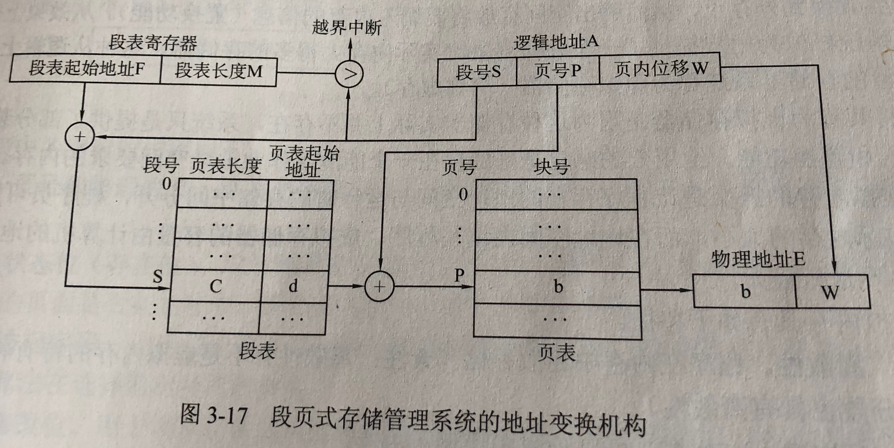

## 虚拟内存管理

- 虚拟内存的基本概念

  1. 虚拟内存的引入原因：让作业部分装入就可以运行的存储管理技术
  2. 局部性原理：时间局限性（程序和数据的执行局限在较短时间内），空间局限性（程序和数据的执行局限在较小区域内）
  3. 虚拟内存的定义及特征：虚拟存储器系统：从逻辑上扩充内存容量的存储器系统；特征：离散性，多次性，对换性（交换性），虚拟性
  4. 实现虚拟内存的硬件和软件支持：外存量，内存量，中断机制，地址变换机制，段表或页表

- 请求分页存储管理方式

  1. 请求分页原理：请求分页=基本分页+请求调页功能+页面置换功能
  2. 页表结构：页表：页号，物理块号，状态位，访问字段，修改位，外存地址
  3. 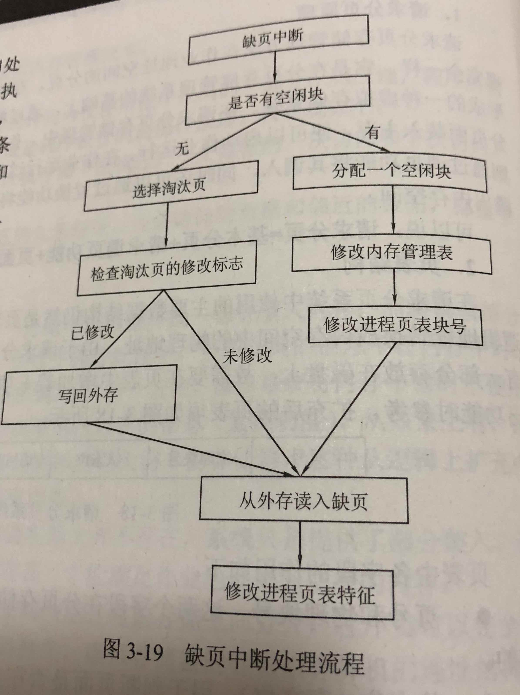
  4. 请求分页管理方式的优缺点：优点（降低碎片数量，提高主存利用率），缺点（需有硬件支持，有抖动现象，程序最后一页仍然存在未被利用的部分空间）

- 页面置换算法

  1. 最佳置换（OPT）算法，OPTimal replacement，当需要调入新页必须替换旧页时，淘汰以后再不访问的或距现在最长时间才访问的页。
  2. 先进先出（FIFO）算法：First In First Out replacement，物理页框会存储页面，排成队列，随着不断有页面进队，也有最先使用的页面出队。
  3. 最近最少使用（LRU）算法：Least Recently Used replacement，淘汰最长时间没访问的页面，这个算法基于程序时间局部性。
  4. 第二次机会（SCR）算法：Second Chance Replacement，最先进入内存的页面如果最近还在使用，仍然有机会像新调入内存的页面一样留在内存，检查FIFO的队首，检查他的引用位，如果是0直接淘汰，如果是1则清0再进队列，再给一次机会。
  5. 时钟置换（CLOCK）算法：Clock policy replacement，本质上和SCR没区别，采用了循环队列构造页面队列。
  6. 页面缓冲（PBA）算法：是对FIFO的改进，建立一个修改页面队列和一个非修改页面队列，当缺页中断，按照FIFO找到淘汰页面，根据修改与否进入队列，需要装入的页面进非修改队列的队首页框。当淘汰页被写回磁盘只需要把该页框连接到非修改队列末尾，当修改页面队列大道一定数量，成批写回，并把空闲页框放入非修改页面队列队尾。

- 工作集与页面分配策略

  1. 工作集理论：预判要访问哪些页面，提前调入内存。工作集：最近n次访问页面的集合，n工作集窗口。原理：监视各工作集，提前安排内存。
  2. 页面分配策略：固定分配局部置换（用算法决定各进程分配物理块的数量），可变分配全局置换（从空闲物理块队列依需分配给缺页的进程），可变分配局部置换（按需分配按需置换）
  3. 页面调入策略：请求调页策略（页面被用到时才被调用到内存，开销大易抖动），预调页策略（基于预判提前调入页面到内存）
  4. 从何处调入页面：请求分页系统的外存分为两个部分：文件区（用于存放文件，离散存储），对换区（用于存放对换页面，连续存储）。

- 抖动现象与缺页率

  1. Belady 异常：先进先出（FIFO）算法的缺页率有时会随着所分配的物理块数的增加而增加。产生原因：FIFO 算法的置换特征与进程访问内存的动态特征相矛盾，即被置换的页面并不是进程不会访问的。
  2. 抖动现象：如果页面置换算法不合适，会出现如下现象：刚被淘汰或调入的页面，又被调入或淘汰。产生原因：在请求分页系统中的每个进程只能分配到所需全部内存空间的一部分。
  3. 缺页率：f=F/A（F 所需页调入内存的次数；A 共需要访问的次数）衡量页面置换算法的重要指标。若过高，读取平均时间会增加。

- 请求分段存储管理系统：与请求分页存储管理系统类似

## 内存管理方式之间的对比与一些计算方法

- 内存管理方式之间的比较
  - 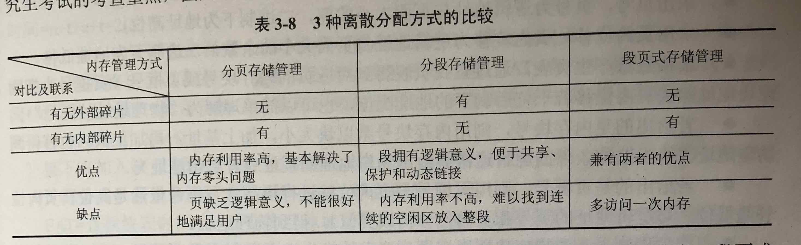
  - 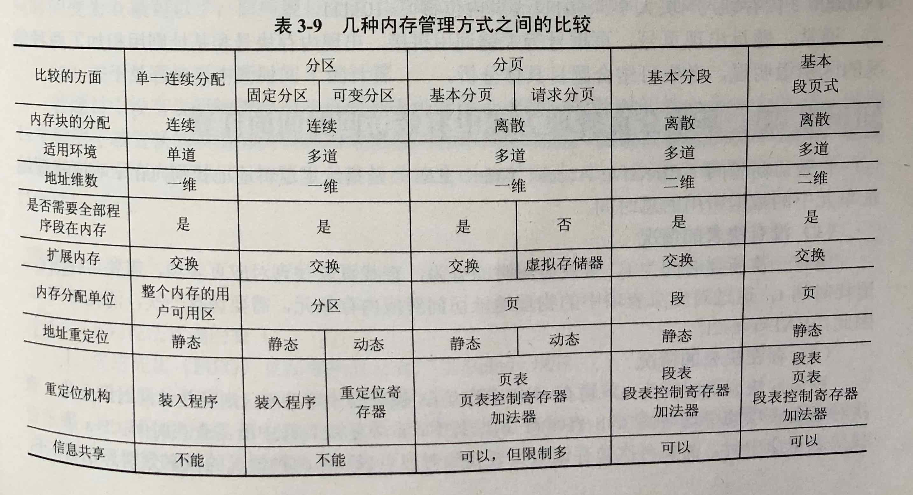
- 内存管理计算中地址的处理
- 基本分页管理方式中有效访问时间的计算
- 请求分页管理方式中有效访问时间的计算

## Reference

- [操作系统学习笔记-03存储管理](http://blog.talisk.cn/blog/2016/01/03/OS-Learning-04-Storage-Manage)
- [操作系统学习笔记：存储管理](http://blog.csdn.net/enjolras/article/details/8868826)