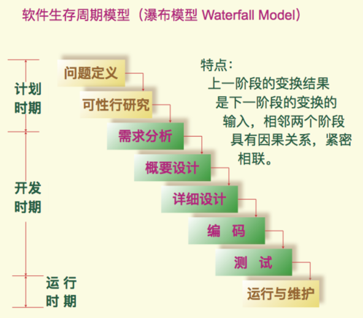
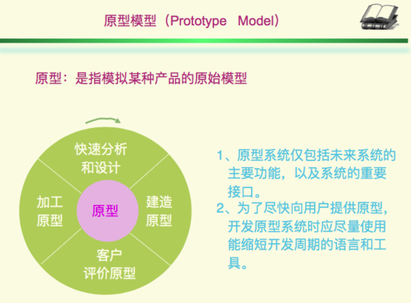

# 软件工程概述

## 软件的概念与特点

- 软件：程序、数据及其相关文档的集合
- 软件特点：实体（逻辑实体，非物理实体），生产（与硬件生产不同），运行和使用（无老化问题），成本（相当昂贵）
- 软件的分类：按功能（系统软件、应用软件、支撑软件），按规模（微型，小型，中型，大型），按开发（软件项目开发，软件产品开发）

## 软件工程的概念及范畴

- 软件工程 software engineering：把软件看作一种工业产品
- 软件工程学
- 软件的演变（传统软件开发 -> 现代软件开发）

## 软件生存周期

- 
- 