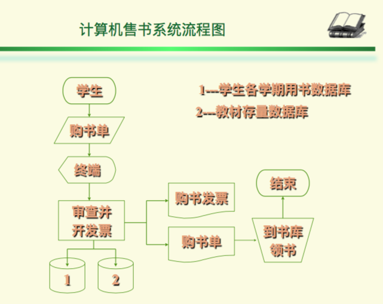
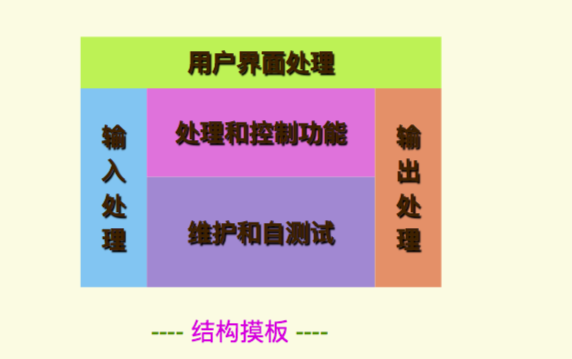
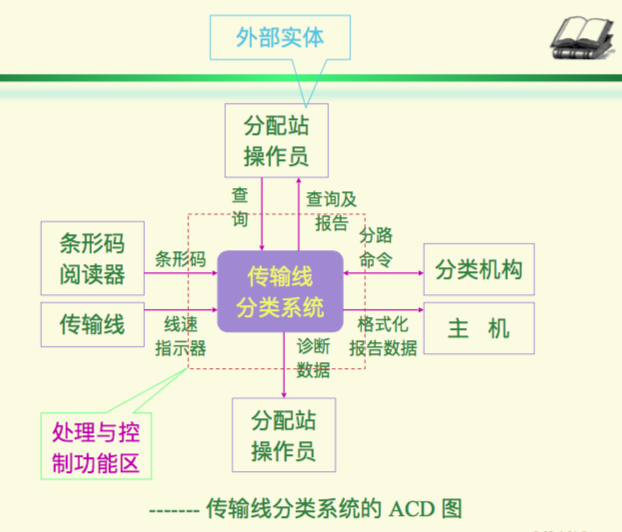

# 问题的定义与可行性研究

## 现状调查和问题的定义

- 目的：弄清楚用户要解决什么问题
- 任务：编写系统目标与规范说明书

## 可行性研究与论证

- 经济可行性：进行成本效益分析，评估项目的开发成本

- 技术可行性：对系统的性能、可靠性、可维护性以及生产率等方面的信息进行评价。
  - 指明需要什么技术、材料、方法。
  - 分析方法：数学模型和优化技术、概率和统计、排队论、控制论

## 可行性分析所需工具

- 系统流程图：用流程符号，描述系统流程
  - 

- 系统结构图：用结构模板，描述系统结构
  - 

- 系统结构环境图（ACD - Architecture Context Diagram）：用方块和连线，描述系统之间的信息边界
  - 