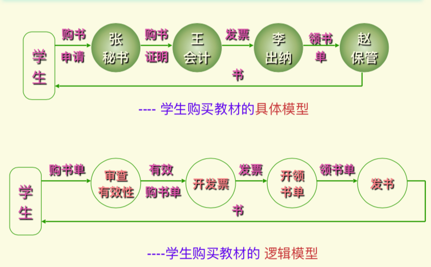
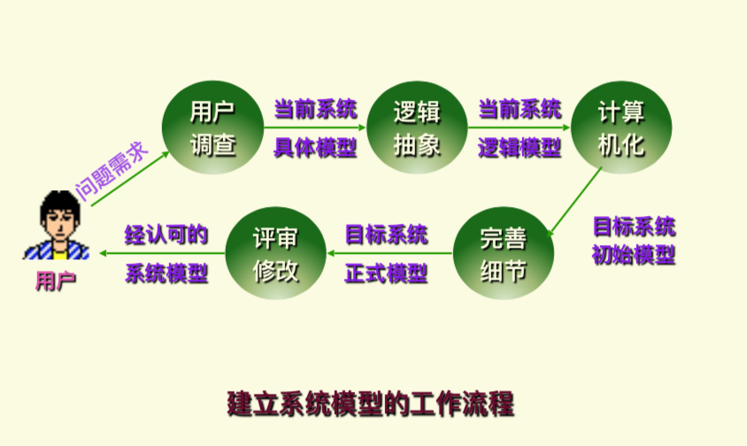
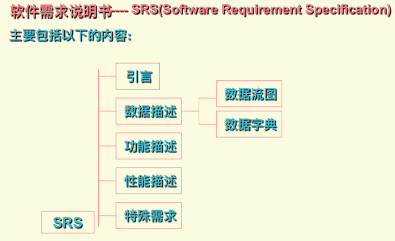
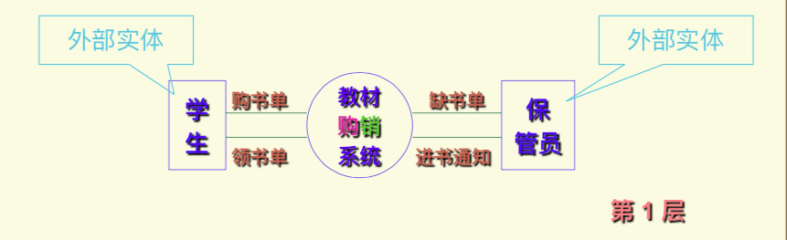
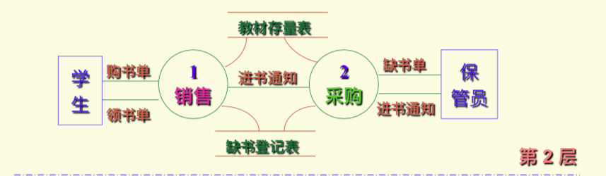
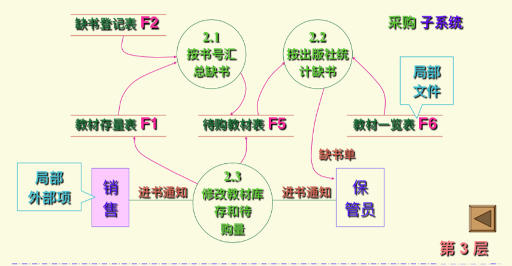
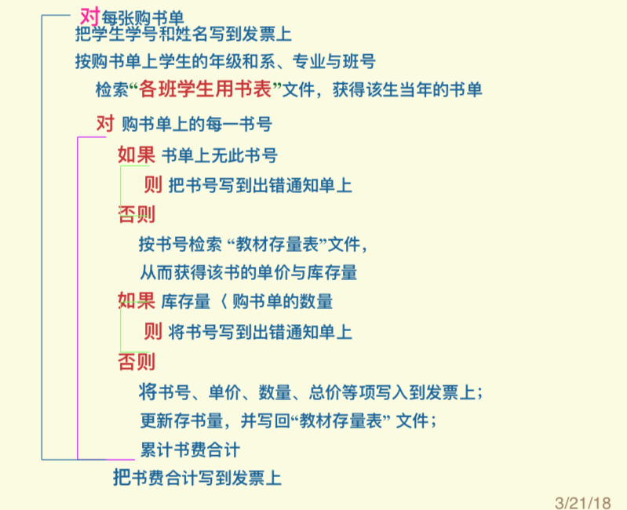
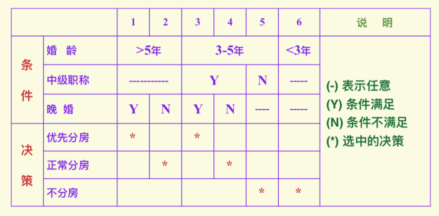
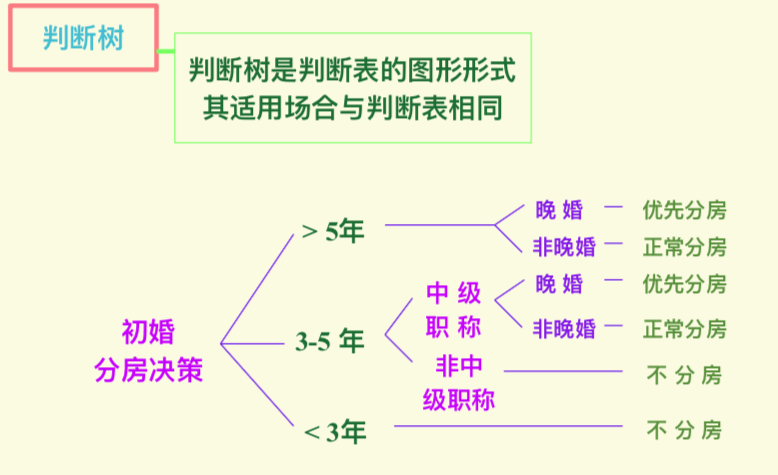

# 软件需求分析

## 需求分析的任务

- 第一步，确定目标系统的具体要求：运行环境要求，性能要求，功能要求

- 第二步，建立目标系统的逻辑模型：借助于当前系统的逻辑模型导出目标系统的逻辑模型，工具：数据流图，数据字典
  - 
  - 

- 第三步，需求规格说明书与评审
  - 

## 面向数据流的方法

- 数据流图 DFD (Data Flow Diagram)：以图形的方式刻画数据流从输入到输出的移动变换过程
  - 
  - 
  - 

- 数据字典 DD (Data Dictionary)：定义数据流图中的每个图形元素：数据流、数据元素、数据文件、加工逻辑、外部实体

- 加工说明 PS (Process Specification)：对数据流图中的每个加工给予说明，描述工具：结构化语言、判定表、判定树
  - 
  - 
  - 

## 面向对象的需求分析

- 面向对象的概念
- 面向对象的分析方法 OOA(Object Oriented Analysis)：识别对象、属性、外部服务、类及其结构，定义对象之间的消息传递
