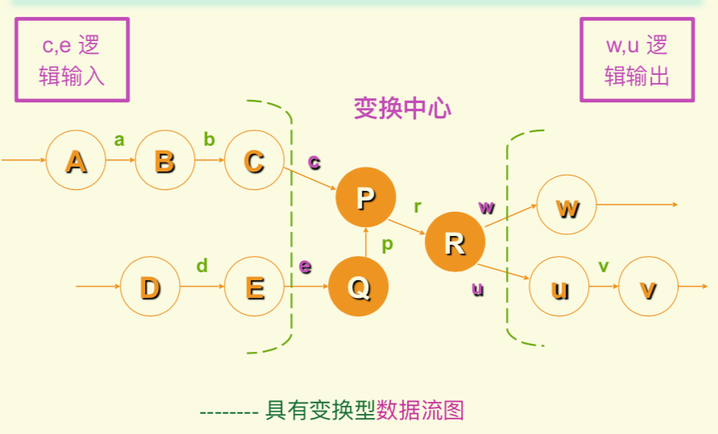

# 软件设计基础

## 软件设计过程

- 

## 软件设计的任务和步骤

- 软件设计的任务和步骤：制定规范，软件系统结构的总体设计，处理方式设计，数据结构设计，可靠性设计

## 软件设计的方法

- 软件设计的方法：结构化设计方法，面向对象的设计方法

## 软件设计的基础

- 模块分解
  - 
  - 

- 信息隐藏：每个模块的实现细节对于其他模块是隐藏的

- 模块的独立性（耦合：模块之间的相对独立性的度量，内聚：模块功能强度的度量）
  - 
  - 内聚种类
    - 巧合性内聚（联系松散）
    - 逻辑性内聚（多个不同功能组合在一起，唯一入口通过参数判定）
    - 信息性内聚（多个不同功能组合在一起，有各自的入口）
    - 功能性内聚（所有成分完成一个功能）
  - 
  - 耦合种类
    - 公共耦合（允许一组模块访问同一全局性的数据结构）
    - 控制耦合（一个模块控制另一个模块）

## 结构化设计方法 SD（Structured Design）

> 结构化设计的目的：使程序的结构尽可能反映要解决的问题的结构
>
> 结构化设计的任务：完成系统结构图 SC

- SC 图 --- Structured Chart：表示系统的软件结构
  - 

- 典型的系统结构形式
  - 模块种类：原子模块（不能再分割的底层模块），传入模块（从下级模块取数据，传给上级模块），传出模块（从上级模块取数据，传给下级模块），变换模块（从上级模块取数据，转换后，传回上级模块），协调模块（对所有下属模块协调和管理的模块）
  - 
  - 
  - 

- 从 DFD 图导出 SC 图的步骤
  - 
  - 变换分析：将具有`变换型`的DFD图导出SC图
    1. 
    2. 
    3. 
    4. 
    5. 
    6. 
    7. 
    8. 
  - 事务分析：将具有`事务型`的DFD图导出SC图
    - 

- 软件模块结构的改进
  - 完善功能
  - 消除重复功能
  - 模块的`作用范围`应在`控制范围`之内: 作用范围（受这个模块中的判定所影响的模块），控制范围（包括模块本身及其所有的从属模块（即供它调用的模块））
    - 
  - 尽可能减少高扇出结构，随着深度增大扇入
    - 
  - 模块的大小要适中，所含语句 50-100 行
  - 应设计出功能可预测的模块，但要避免过分受限制的模块