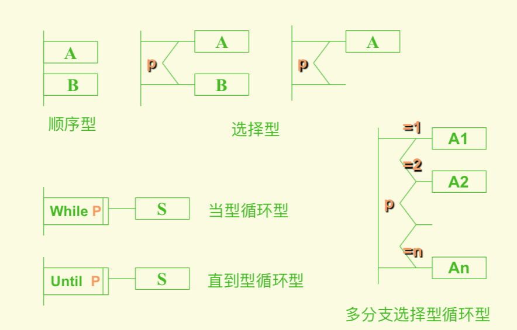

# 详细设计描述的工具

## 详细设计阶段的目的与任务

- 目的: 为 SC 图中每个模块确定：`算法`，`数据结构`，`外部接口、用户界面`，`测试用例`，⽤某种选定的表达工具给出清晰的描述。

- 主要任务: 编写软件 的 “详细设计说明书”

## 详细设计阶段的描述工具（程序流程图， N-S 图，PAD 图，PDL 伪代码）

- 程序流程图
  - 
  - 

- N-S 图 (Nassi and Shneideman)
  - 
  - 

- PAD (Problem Analysis Diagram)
  - 
  - 

- 伪代码 PDL (Program Design Language)
  - 符号格式
  - 数据说明：TYPE <变量量名> AS <限定词1> <限定词2>
  - 程序块：
    ```p
      BEGIN <块名>
      <一组伪代码语句句>
    ```END
  - ⼦程序结构
    ```p
    PROCEDURE <⼦程序名> <⼀组属性>
      INTERFACE <参数表>
        <程序块或⼀组伪代码语句句>
    END
    ```
  - 基本控制结构
    ```p
    IF <条件>
      THEN <程序块/伪代码语句句组>;
      ELSE <程序块/伪代码语句句组>;
    ENDIF

    DO WHILE <条件描述>
      <程序块/伪代码语句句组>;
    ENDDO

    REPEAT UNTIL <条件描述>
      <程序块/伪代码语句句组>;
    ENDREP

    DO LOOP <条件描述>
      <程序块/伪代码语句句组>;
      EXIT WHEN
    ENDLOOP

    DO FOR <下标=下标表，表达式>
      <程序块/伪代码语句句组>;
    ENDFOR

    CASE OF <case 变量量名>;
      WHEN < case 条件1> SELECT <程序块/伪代码语句句组>;
      WHEN < case 条件2> SELECT <程序块/伪代码语句句组>; ......
      DEFAULT: < 缺省或错误case: <程序块/伪代码语句句组>;
    ENDCASE

    READ/WRITE TO <设备> <I/O表>
    ```
  - 