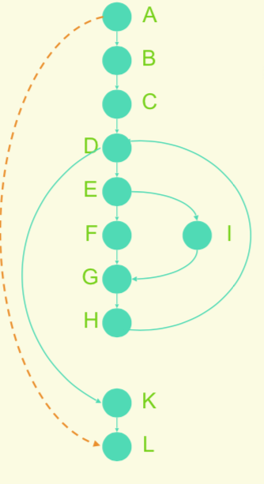

# 程序编码

## 编码的目的

是使⽤用选定的程序设计语⾔，把模块的过程性描述翻译为⽤用该语言书写的源程序(源代码)

## 结构化程序设计 Structured Programming

结构化程序设计是⼀种设计程序的技术，它采⽤用`自顶向下逐步细化`的设计⽅方法和`单入口`(Single entry) `单出⼝`(Single exit)的控制结构。这种控制结构包括有:`顺序、选择和循环`。

- 结构化程序设计的原则
  1. 使⽤语⾔中的顺序、选择、重复等有限的基本控制结构表示程序
  2. 选⽤的控制结构只准许有⼀个⼊口和⼀个出⼝
  3. 程序语句组成容易易识别的块(Block),每块只有⼀个⼊口和⼀个出口
  4. 复杂结构应该⽤基本控制结构进⾏组合嵌套来实现
  5. 严格控制GOTO语句

- 程序设计⾃自顶向下，逐步求精
  1. 程序设计是一个由粗到细的 “渐进” 的过程
  2. 程序设计不仅包括对控制结构的设计，也包括对数据结构的设计。⼆者都要⼀步一步地细化。

- 程序复杂性的度量

  - 代码⾏度量法：统计程序中的源代码的行数

  - McCabe 度量法：利用程序的控制流来度量程序的复杂性

    该⽅法是利用程序模块的程序图中环路的个数，来计算程序的复杂性的。为此该⽅法也称为环路复杂度计算法。
    ```c
    V(G)=m-n+p
    V(G) 是有向图G中环路路数
    m: 为图G中弧数
    n: 为图G中节点数
    p: 为图G中强连通分量量个数
    ```
    示例：
    ```c
    V(G)=13-11+1=3
    ```
    程序的环路复杂度则取决于程序控制流的复杂度，也就是取决于程序结构的复杂程度。当程序内分⽀或循环个数增加时，则相应地环域复杂度也随之增加。因此，它是对测试难度的⼀种定量度量，也能对软件最终的可靠性给出某种预测。

- 程序效率: 程序效率是指程序的执⾏速度及程序占⽤的存储空间。

  - 算法对效率的影响
    1. 在编程序前，尽可能化简有关的算术表达式和逻辑表达式
    2. 应尽量量把与循环变量量⽆无关的运算移到循环外去
    3. 尽量避免使⽤多维数组
    4. 尽量避免使⽤指针和复杂的表
    5. 不要混淆数据类型，避免在表达式中出现类型混杂
    6. 尽量采⽤整数算术表达式和布尔表达式
    7. 选⽤等效的高效率算法
    8. 应把变化范围⼤大的循环变量量放在内层

- 程序设计⻛风格 Coding style
  1. 保持控制流的直线性
  2. 避免使⽤用模糊或费解的结构
  3. 保持控制流的局部性，注意goto语句的使用