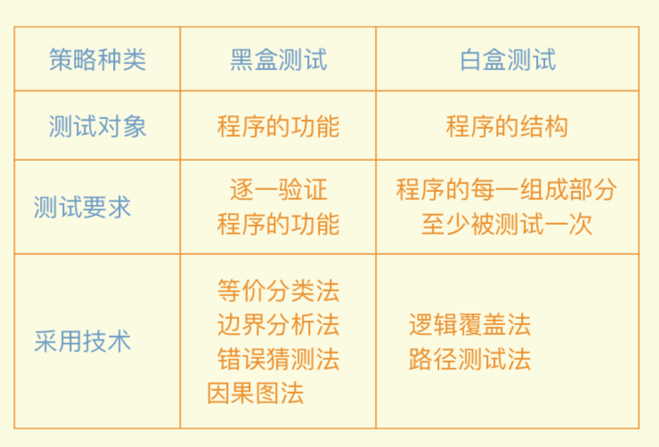

# 软件测试

## 软件测试的基础

- 软件测试：为了发现错误⽽执行程序的过程
- 软件测试的对象：需求规格说明、概要设计说明、详细设计规格说明以及源程序
- 
- 测试与软件开发阶段的关系：软件开发过程是一个自顶向下、逐步细化的过程，⽽测试则是依相反的顺序安排的，⾃底向上、逐步集成的过程。低⼀级为上一级测试准备件。

## 软件测试设计的方法

- 以最少量的时间和⼈力，最⼤可能地发现最多的错误
- ⽩盒测试 (White Box Testing)：对软件的过程性细节做细致的检查。
- 黑盒测试 (Black Box Testing)：测试证明每个实现了的功能是否符合要求

## 白盒测试用例的设计

- 逻辑覆盖法：采⽤流程图来设计测试⽤例，它考察的重点是图中的判定框
- 路径测试法：覆盖程序中每一条可能的程序执行路径至少测试⼀一次，如果程序中含有循环(在程序图中表现为环)则每个循环至少执行一次。

## 黑盒测试用例的设计

- 等价分类法：把全部输入数据合理地划分为若干等价类，在每⼀个等价类中取⼀个数据作为测试的输入条件，这样就可以少量的代表性测试数据，来取得较好的测试结果
  - 有效等价类：合理的有意义的输入数据，无效等价类：不合理的无意义的输入数据
  - 设计⼀个新的测试⽤例，使其尽可能地覆盖尚未被覆盖的有效等价类和无效等价类，重复这⼀步，直到所有的有效等价类都被覆盖为止。

- 边界值分析：可使得被测程序能在边界值及其附近运行，从⽽更有效地暴露程序中潜藏的错误。

- 错误猜测法：猜测被测程序在哪些地⽅容易出错，然后针对可能的薄弱环节来设计测试⽤例

- 因果图法：借助图形来设计测试⽤例的⼀种系统方法

- 